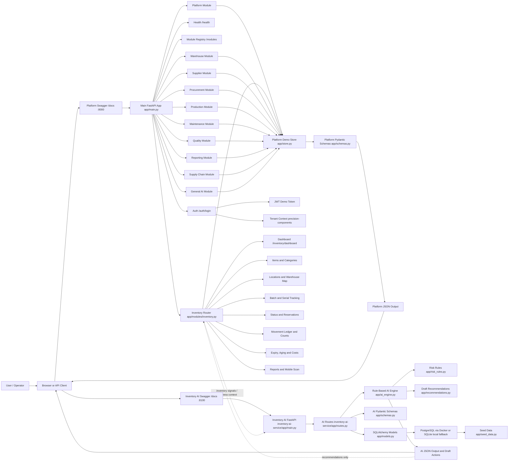
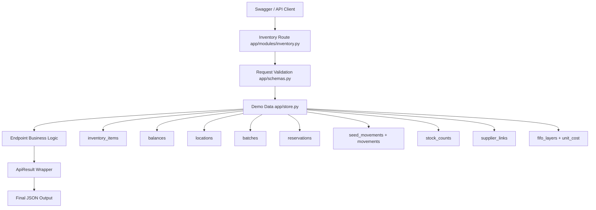
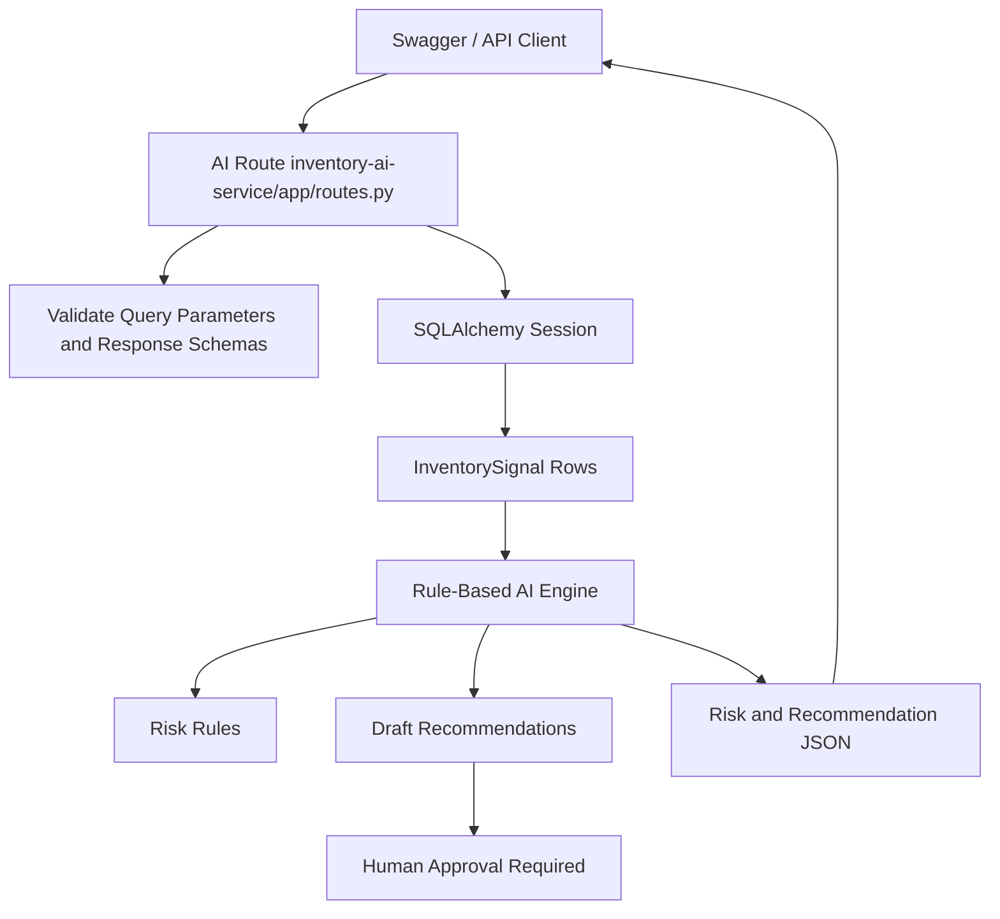
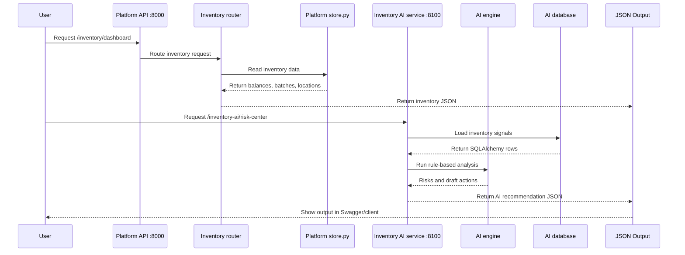

# End-to-End Scheme Diagram

This diagram shows the current Python-only Manufacturing Operations Platform after adding the expanded Inventory module and the separate `inventory-ai-service/` microservice.

There are now two FastAPI services:

- Main platform API: `http://127.0.0.1:8000/docs`
- Inventory AI service: `http://127.0.0.1:8100/docs`

The AI service is recommendation-only. It analyzes risk, creates draft actions, and requires human approval for critical actions. It does not automatically move stock, create purchase orders, change production, write off inventory, or execute supplier actions.

## Runtime Flow

1. User opens the main platform Swagger at `http://127.0.0.1:8000/docs`.
2. Main FastAPI receives platform requests in `app/main.py`.
3. `app/main.py` forwards Inventory requests to `app/modules/inventory.py`.
4. Inventory request data is validated using `app/schemas.py`.
5. Inventory endpoints read or write demo data in `app/store.py`.
6. Platform endpoints return structured JSON through the common `ApiResult` response model.
7. User opens the Inventory AI service Swagger at `http://127.0.0.1:8100/docs`.
8. Inventory AI requests go through `inventory-ai-service/app/routes.py`.
9. AI routes call rule-based logic in `ai_engine.py`, `risk_rules.py`, and `recommendations.py`.
10. SQLAlchemy models read seed/demo inventory signals from PostgreSQL or the local SQLite fallback.
11. AI returns analysis, risk levels, recommendations, and draft actions only.
12. Human approval is required before any critical operational action.

## Main Inventory Module Views

| View | Endpoint | Output |
| --- | --- | --- |
| Inventory Dashboard | `GET /inventory/dashboard` | Total inventory value, available/reserved stock, low-stock risks, expiry risks, blocked stock, warehouse occupancy |
| Inventory Items | `GET /inventory/items` | Raw materials, WIP, finished goods, consumables and spare parts |
| Category View | `GET /inventory/items/by-category` | Items grouped by category |
| Tracking Types | `GET /inventory/tracking-types` | None, batch, serial and batch+serial counts |
| Stock Location | `GET /inventory/locations` | Plant, warehouse, zone, rack, shelf, bin and exact product location |
| 2D Warehouse Map | `GET /inventory/warehouse-map` | Bin occupancy, searched item highlight, empty/full/congested areas |
| Batch and Serial | `GET /inventory/batches` | Batch number, serial number, supplier batch, manufacturing date, expiry date and status |
| Inventory Status | `GET /inventory/status` | Available, reserved, allocated, in transit, quarantine, rejected, expired, consumed, returned and damaged views |
| Reservations | `GET /inventory/reservations`, `POST /inventory/reservations` | Reserved stock for production, customer order, transfer and maintenance |
| Movement Ledger | `GET /inventory/movement-ledger`, `POST /inventory/movements` | Receiving, transfer, adjustment, consumption, return, damage, write-off and scrap audit trail |
| Stock Counting | `GET /inventory/stock-counts`, `POST /inventory/stock-counts` | Manual, cycle, barcode, QR and blind counts with variance/approval |
| Expiry and Aging | `GET /inventory/expiry-aging` | Expiring soon, expired, non-moving, slow-moving and suggested actions |
| Procurement Recommendations | `GET /inventory/procurement-recommendations` | Low stock, reorder level, safety stock, supplier lead time and purchase request draft |
| Supplier Links | `GET /inventory/supplier-links` | Primary, backup and emergency supplier data |
| Inventory Costs | `GET /inventory/costs` | FIFO costing, valuation, wastage, damaged stock cost and expiry loss |
| Reports | `GET /inventory/reports` | Status, aging, valuation, movement, occupancy and supplier performance reports |
| Mobile Inventory | `POST /inventory/mobile/scan` | Receive, move, scan, count, upload photos, offline queue and sync status |

## Inventory AI Service Views

| AI View | Endpoint | Output |
| --- | --- | --- |
| Inventory Risk Center | `GET /inventory-ai/risk-center` | Low stock, stockout, supplier delay, production, expiry and dead stock risks |
| Shortage Prediction | `GET /inventory-ai/shortage-prediction` | Available quantity, days remaining, expected stockout date and risk level |
| Overstock Prediction | `GET /inventory-ai/overstock` | Excess quantity and overstock risk |
| Procurement Recommendation | `GET /inventory-ai/procurement-recommendations` | Recommended order quantity/date, supplier priority and draft action |
| Expiry Intelligence | `GET /inventory-ai/expiry-intelligence` | Days to expiry, quantity at risk and recommended action |
| Dead Stock Detection | `GET /inventory-ai/dead-stock` | Dead stock status, days without movement and financial risk |
| Production Impact | `GET /inventory-ai/production-impact` | Can produce, shortage items and production delay risk |
| Inventory Optimization | `GET /inventory-ai/optimization` | Draft recommendations to increase/reduce safety stock, transfer, reorder or consume expiring batch first |

## Inventory Data Flow

## Inventory AI Data Flow

## Code Flow

