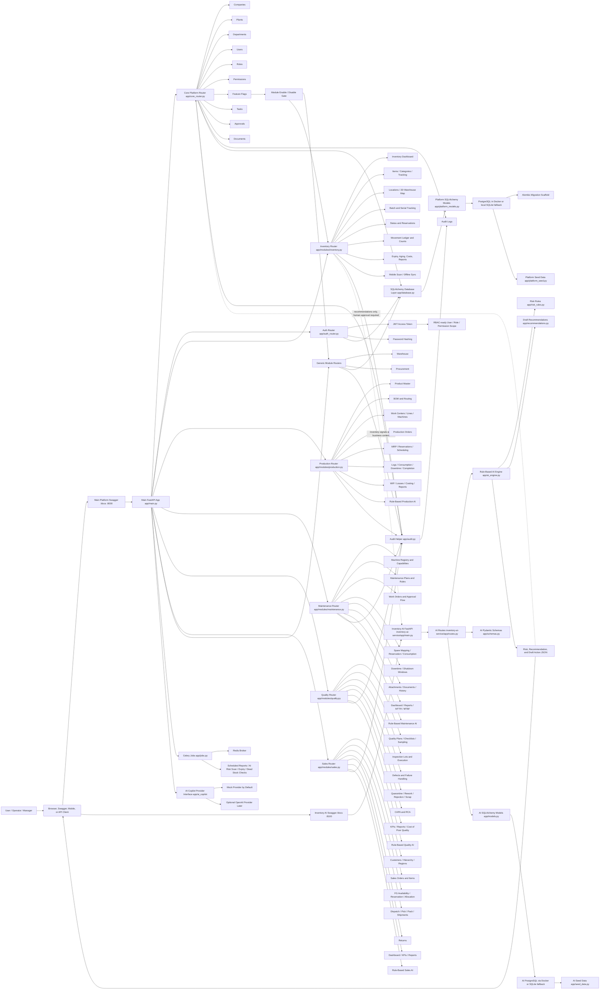
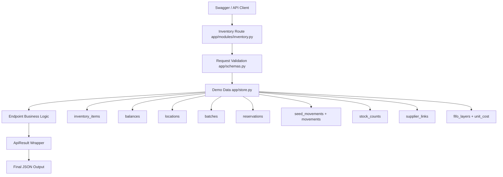
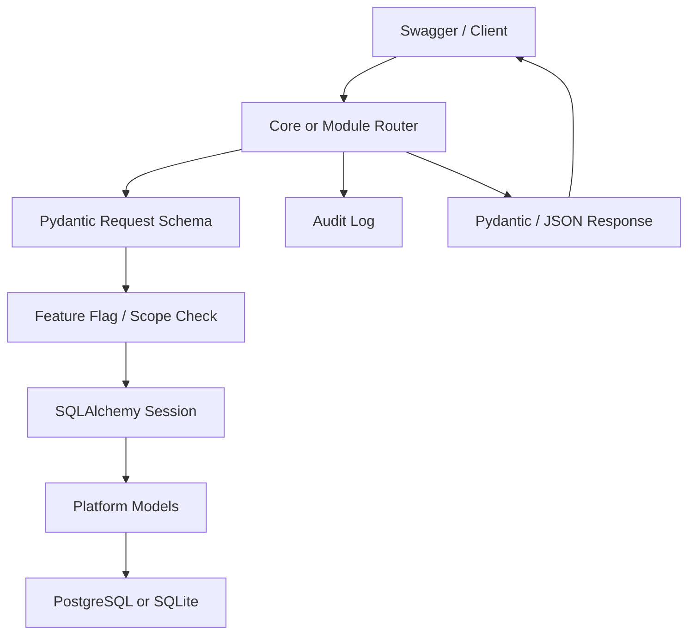
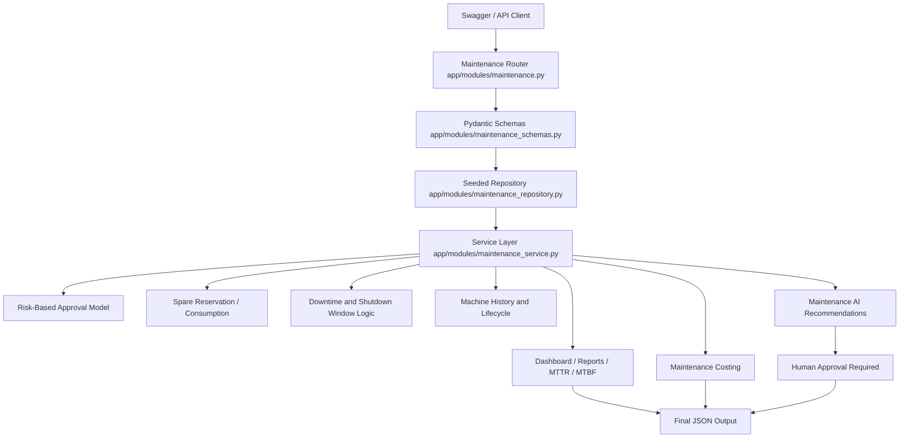
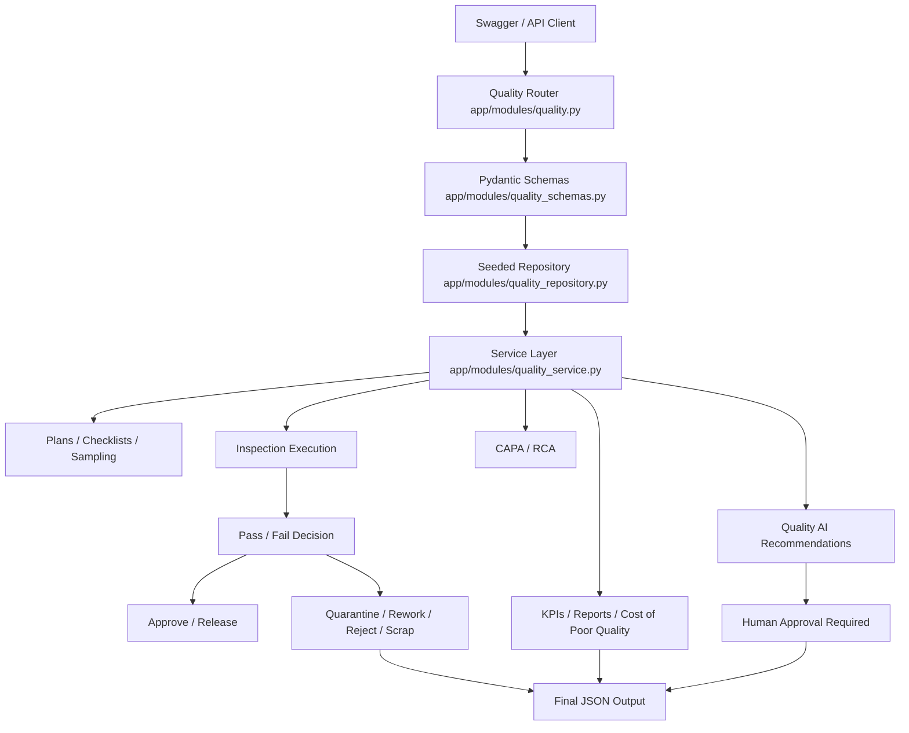
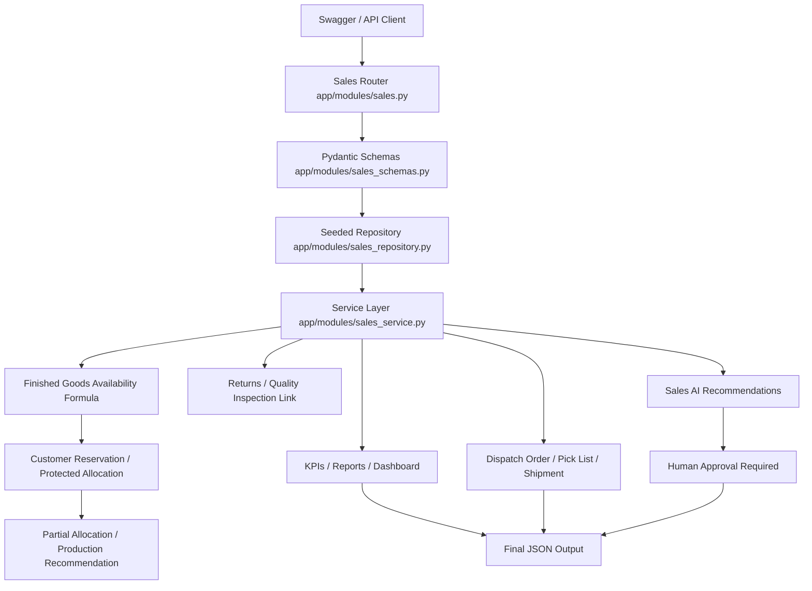
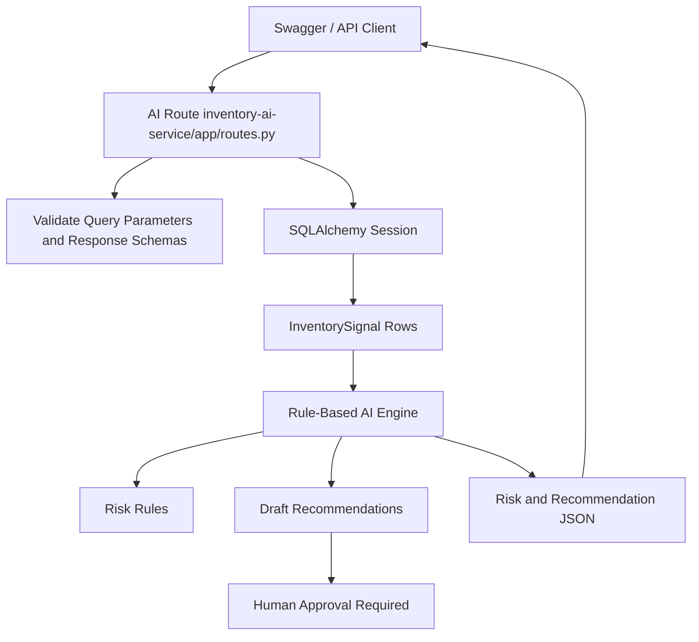
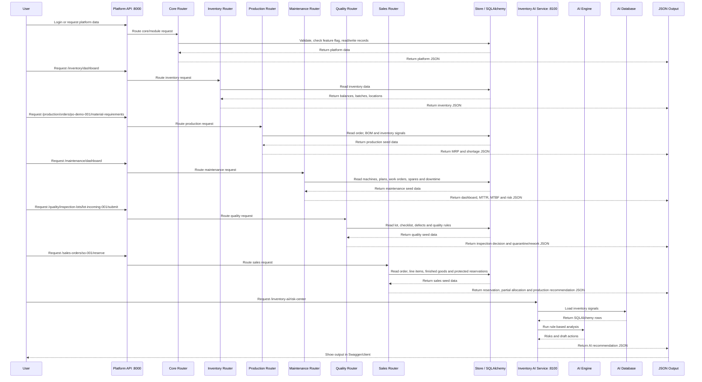
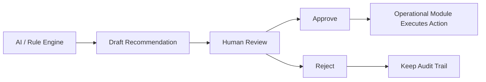

# End-to-End Scheme Diagram

This diagram shows the current Python-only Manufacturing Operations Platform after adding the modular platform foundation, expanded Inventory module, and separate `inventory-ai-service/` microservice.

There are two FastAPI services:

- Main platform API: `http://127.0.0.1:8000/docs`
- Inventory AI service: `http://127.0.0.1:8100/docs`

The AI service is recommendation-only. It analyzes risk, creates draft actions, and requires human approval for critical actions. It does not automatically move stock, create purchase orders, change production, write off inventory, or execute supplier actions.

## Runtime Flow

1. User opens the main platform Swagger at `http://127.0.0.1:8000/docs`.
2. `app/main.py` starts the main FastAPI service, creates SQLAlchemy tables when needed, and seeds demo platform data.
3. Auth requests go through `app/auth_router.py` and return JWT tokens.
4. Core platform requests go through `app/core_router.py`.
5. Company, plant, department, user, role, permission, task, approval, document, and audit data is stored through SQLAlchemy models in `app/platform_models.py`.
6. Feature flags decide whether module APIs are enabled.
7. Generic module routers store warehouse and procurement records in `ModuleRecord`.
8. Inventory requests go through `app/modules/inventory.py`.
9. Production requests go through `app/modules/production.py`.
10. Maintenance requests go through `app/modules/maintenance.py`.
11. Quality requests go through `app/modules/quality.py`.
12. Sales requests go through `app/modules/sales.py`.
13. Inventory, Production, Maintenance, Quality and Sales data are validated with Pydantic schemas and returned as structured JSON.
14. Background jobs are prepared in `app/jobs.py` using Celery and Redis.
15. User opens the Inventory AI service Swagger at `http://127.0.0.1:8100/docs`.
16. Inventory AI requests go through `inventory-ai-service/app/routes.py`.
17. AI routes call rule-based logic in `ai_engine.py`, `risk_rules.py`, and `recommendations.py`.
18. AI returns analysis, risk levels, recommendations, and draft actions only.
19. Human approval is required before any critical operational action.

## Main Platform Modules

| Area | Current Code | Purpose |
| --- | --- | --- |
| Application entry | `app/main.py` | Starts FastAPI, includes routers, initializes database and seed data |
| Database layer | `app/database.py` | SQLAlchemy engine, session, base model and dependency |
| Platform models | `app/platform_models.py` | Company, plant, department, user, role, permission, flags, tasks, approvals, documents, audit logs, module records |
| Platform schemas | `app/platform_schemas.py` | Pydantic request/response models for core platform APIs |
| Auth | `app/auth_router.py`, `app/security.py` | JWT, password hashing, database-backed login structure |
| Core router | `app/core_router.py` | Core APIs and generic module router factory |
| Feature flags | `app/feature_flags.py` | Module enable/disable checks |
| Audit | `app/audit.py` | Audit log writer for platform actions |
| Seed data | `app/platform_seed.py` | Demo company, plant, admin user, roles, permissions and module flags |
| Background jobs | `app/jobs.py` | Celery jobs for reports, AI risk scans, expiry checks and dead stock checks |
| AI copilot | `app/ai_copilot/` | Provider interface with mock provider and optional OpenAI provider |
| Production module | `app/modules/production.py` | Dedicated Production Management APIs |
| Production service | `app/modules/production_service.py` | MRP, reservations, scheduling, costing, reports and Production AI rules |
| Production schemas | `app/modules/production_schemas.py` | Pydantic schemas for Production requests |
| Production models | `app/modules/production_models.py` | SQLAlchemy table definitions for Production Management |
| Maintenance module | `app/modules/maintenance.py` | Dedicated Maintenance Management APIs and root aliases |
| Maintenance service | `app/modules/maintenance_service.py` | Approvals, spares, downtime, health score, reports and Maintenance AI rules |
| Maintenance schemas | `app/modules/maintenance_schemas.py` | Pydantic schemas for Maintenance requests |
| Maintenance models | `app/modules/maintenance_models.py` | SQLAlchemy table definitions for Maintenance Management |
| Quality module | `app/modules/quality.py` | Dedicated Quality Management APIs |
| Quality service | `app/modules/quality_service.py` | Inspection execution, failure handling, KPIs, reports and Quality AI rules |
| Quality schemas | `app/modules/quality_schemas.py` | Pydantic schemas for Quality requests |
| Quality models | `app/modules/quality_models.py` | SQLAlchemy table definitions for Quality Management |
| Sales module | `app/modules/sales.py` | Dedicated Sales & Distribution APIs |
| Sales service | `app/modules/sales_service.py` | Availability, reservations, allocation, dispatch, KPIs, reports and Sales AI rules |
| Sales schemas | `app/modules/sales_schemas.py` | Pydantic schemas for Sales requests |
| Sales models | `app/modules/sales_models.py` | SQLAlchemy table definitions for Sales & Distribution |
| Migrations | `alembic/` | Alembic migration scaffold |
| Docker | `docker-compose.yml` | PostgreSQL, Redis, main API and worker services |

## Generic Backend Applications

| Application | Endpoint Family | Current Behavior |
| --- | --- | --- |
| Warehouse | `/warehouses`, `/warehouse-locations`, `/warehouse-movements`, `/warehouse-occupancy` | Stores module records after feature flag validation |
| Procurement | `/suppliers`, `/purchase-requisitions`, `/purchase-orders` | Stores supplier and purchasing module records |
| Production | `/production/*` | Dedicated Production Management module with planning, execution, costing, reporting and AI |
| Maintenance | `/maintenance/*`, `/machines`, `/maintenance-plans`, `/work-orders`, `/ai/maintenance/*` | Dedicated Maintenance Management module with CMMS/EAM workflows and AI |
| Quality | `/quality/*`, `/ai/quality/*` | Dedicated Quality Management module with QMS workflows and AI |
| Sales | `/customers`, `/sales-orders`, `/dispatch-orders`, `/shipments`, `/returns`, `/ai/sales/*` | Dedicated Sales & Distribution module with order, allocation, dispatch, returns and AI |
| Inventory | `/inventory/*` | Expanded dedicated inventory module with operational views |
| Inventory AI | `/inventory-ai/*` | Separate AI/rule-based intelligence service |

## Production Management Views

| View | Endpoint | Output |
| --- | --- | --- |
| Production Dashboard | `GET /production/dashboard` | Active orders, risk count, shortages, utilization, downtime, shift output, planned vs actual, WIP and completed orders |
| Product Master | `GET/POST/PUT/DELETE /production/products` | Finished products, semi-finished products, sub-assemblies and by-products |
| BOM Management | `GET/POST/PUT /production/bom`, `POST /production/bom/{bom_id}/approve` | Multi-level BOM, versioning, approval workflow, material lines and consumption type |
| Routing Management | `GET/POST/PUT /production/routing` | Operations, sequence, work center, line, setup/run time, labor, machine and quality checks |
| Work Centers | `GET/POST /production/work-centers` | Capacity, plant, department, operating calendar and active status |
| Production Lines | `GET/POST /production/lines` | Line capacity, shift calendar and active/maintenance/unavailable status |
| Machines | `GET/POST /production/machines` | Machine registry with status, runtime, downtime and capacity |
| Production Orders | `GET/POST/PUT /production/orders` | Production source, product, BOM/routing, quantity, dates, priority, line, work center and status |
| Material Planning | `POST /production/orders/{order_id}/material-requirements` | Required quantity from BOM and production quantity |
| Reservations | `POST /production/orders/{order_id}/reserve-materials` | Required, available, reserved and shortage quantities |
| Time-Aware Plan | `GET /production/orders/{order_id}/time-aware-plan` | Current inventory, incoming inventory, supplier lead time and procurement requirement |
| Scheduling | `GET/POST /production/schedules` | Schedules with line, machine, maintenance, inventory, capacity and shift conflict detection |
| Shifts | `GET/POST /production/shifts` | Morning, evening, night and custom shifts |
| Daily Logs | `GET/POST /production/logs` | Planned/actual output, material consumed, downtime, wastage and remarks |
| Consumption | `GET/POST /production/material-consumption` | Reserve-first material consumption and variance tracking |
| Downtime | `GET/POST /production/downtime` | Mechanical, electrical, material, operator, quality, maintenance and other downtime |
| Completion | `POST /production/completion` | Final output, consumption finalization, unused reservation release, variance, cost and quality handoff |
| WIP | `GET/POST /production/wip` | Raw material to WIP to finished goods stages |
| Losses | `GET/POST /production/losses` | Waste, scrap, rework, rejection and over-consumption |
| Costing | `GET /production/costing`, `POST /production/orders/{order_id}/costing` | Material, machine, labor, overhead, wastage, rework and cost per unit |
| Reports | `GET /production/reports` | Orders, daily production, shifts, consumption, variance, downtime, capacity, WIP and cost reports |
| Production AI | `/production/ai/*` | Risk, delay, bottleneck, capacity, schedule, what-if, variance, downtime, cost and draft-action recommendations |

## Maintenance Management Views

| View | Endpoint | Output |
| --- | --- | --- |
| Maintenance Dashboard | `GET /maintenance/dashboard` | Open work orders, overdue plans, breakdown machines, spare shortages, MTTR, MTBF, downtime, cost and upcoming maintenance |
| Machine Registry | `GET/POST /maintenance/machines`, `GET/POST /machines` | Machine master with company, plant, line, work center, status, criticality, capacity, location and capability flags |
| Machine Detail | `GET/PUT/DELETE /maintenance/machines/{machine_id}` | Machine details, lifecycle status and capabilities |
| Rule Engine | `GET/POST /maintenance/rules` | Calendar, runtime, production-aware, shutdown-window, manual and breakdown rules |
| Preventive Plans | `GET/POST/PUT /maintenance/maintenance-plans`, root alias `/maintenance-plans` | Preventive maintenance plans, frequency, due dates, required spares, documents and approval requirement |
| Work Orders | `GET/POST/PUT /maintenance/work-orders`, root alias `/work-orders` | Breakdown, preventive, runtime, inspection, calibration and compliance work orders |
| Assignment | `POST /maintenance/work-orders/{work_order_id}/assign` | Assign technician, team, vendor or contractor |
| Execution | `POST /maintenance/work-orders/{work_order_id}/start`, `/complete`, `/close` | Start, complete and close maintenance with status, validation, cost, history and audit trail |
| Spare Parts | `GET/POST /maintenance/spare-parts` | Machine-specific spare mapping, compatibility, criticality, thresholds and suppliers |
| Spare Reservation | `POST /maintenance/spare-reservations` | Check inventory, reserve spare, create shortage/procurement draft when unavailable |
| Spare Usage | `GET /maintenance/spare-usage` | Spare consumption and cost history |
| Downtime Events | `GET/POST /maintenance/downtime-events` | Manual categorized downtime with root cause, production loss and cost impact |
| Shutdown Windows | `GET/POST /maintenance/shutdown-windows` | Planned shutdown windows for plant, line or machine |
| Documentation | `GET/POST /maintenance/attachments`, `/maintenance/machine-documents` | Work order photos, documents, invoices, manuals, certificates and service reports |
| Runtime Logs | `GET/POST /maintenance/runtime-logs` | Runtime tracking for runtime-based maintenance |
| Vendors | `GET/POST /maintenance/vendors` | External maintenance providers, contracts and service type |
| Costing | `GET /maintenance/costing` | Spare, labor, vendor, downtime, production loss and total maintenance cost |
| Reports | `GET /maintenance/reports` | Schedule, work order, breakdown, downtime, spare, history, cost, MTTR, MTBF and overdue reports |
| Maintenance AI | `/ai/maintenance/*` | Risk center, failure, downtime, spare, health, root cause, cost impact, recommendations and draft actions |

## Quality Management Views

| View | Endpoint | Output |
| --- | --- | --- |
| Quality Dashboard | `GET /quality/dashboard` | Pending inspections, failed inspections, quarantine, rework, rejection rate, defect trend, supplier issues, CAPA, FPY and cost of poor quality |
| Quality Plans | `GET/POST/PUT /quality/plans` | Configurable plans by company, plant, product, material, supplier, customer, process, line, machine and criticality |
| Checklists | `GET/POST /quality/checklists` | Checklist definitions, items, parameters, tolerances, photos and document requirements |
| Sampling Rules | `GET/POST /quality/sampling-rules` | Lot size, sample size, acceptance/rejection quantity, inspection level and severity |
| Inspection Lots | `GET/POST /quality/inspection-lots` | Lots from goods receipt, production completion, WIP, customer return, rework and manual quality requests |
| Inspection Execution | `POST /quality/inspection-lots/{lot_id}/start`, `/submit`, `/approve`, `/reject` | Checklist responses, measurements, pass/fail, defects, comments, signatures and approvals |
| Defects | `GET/POST /quality/defects` | Defect category, severity, source, affected quantity, photos and status |
| Quarantine | `GET/POST /quality/quarantine`, `POST /quality/quarantine/{id}/release` | Failed or blocked inventory movement to quarantine and controlled release |
| Rework | `GET/POST /quality/rework` | Rework workflow from failed inspection through reinspection |
| Rejections | `GET/POST /quality/rejections` | Rejected stock blocked from use with cost impact |
| Scrap | `GET/POST /quality/scrap` | Scrap workflow with estimated loss and approval requirement |
| CAPA | `GET/POST/PUT /quality/capa` | Corrective and preventive action, root cause, owner, due date and effectiveness checks |
| KPIs | `GET /quality/kpis` | FPY, defect rate, rework rate, scrap rate, supplier rejection, customer return, CAPA closure and COPQ |
| Reports | `GET /quality/reports` | Inspection, defect, quarantine, rework, rejection, scrap, CAPA, supplier, production, customer return and COPQ reports |
| Quality AI | `/ai/quality/*` | Risk center, defect prediction, trends, supplier risk, production risk, root cause, cost risk and draft actions |

## Sales & Distribution Views

| View | Endpoint | Output |
| --- | --- | --- |
| Sales Dashboard | `GET /sales/dashboard` | Open orders, approval queue, shortages, production requirement, dispatch delays, regional sales, returns and finished goods availability |
| Customer Master | `GET/POST/PUT/DELETE /customers` | Customer records, region, territory, sales rep, plant assignment and active status |
| Regions and Territories | `GET/POST /regions`, `GET/POST /territories` | Regional sales mapping for demand, allocation and dispatch planning |
| Plant Representatives | `GET/POST /plant-representatives` | Plant representative allocation authority and limits |
| Sales Orders | `GET/POST/PUT /sales-orders` | Customer order header and line items |
| Order Workflow | `POST /sales-orders/{id}/submit`, `/approve`, `/reserve`, `/dispatch`, `/close` | Approval, inventory check, reservation, dispatch and closure |
| Allocation | `GET/POST /allocations` | Customer allocation, protected reservation check and override approval requirement |
| Dispatch Orders | `GET/POST /dispatch-orders` | Dispatch order, pick list, FEFO/FIFO location and packing status |
| Shipments | `GET/POST/PUT /shipments` | Carrier, vehicle, tracking, driver, status, delivery dates and proof of delivery |
| Returns | `GET/POST/PUT /returns` | Return request, approval, received, quality pending, restock, rework, scrap, replace or credit |
| KPIs | `GET /sales/kpis` | Fulfillment, delivery, fill rate, backorder, returns, demand growth, delay and profitability |
| Reports | `GET /sales/reports` | Orders, customers, regional sales, allocation, dispatch, shipment delay, returns, profitability, demand and inventory reports |
| Sales AI | `/ai/sales/*` | Risk center, demand forecast, order risk, allocation, regional demand, expiry-aware sales, profitability, dispatch, returns and draft actions |

## Main Inventory Module Views

| View | Endpoint | Output |
| --- | --- | --- |
| Inventory Dashboard | `GET /inventory/dashboard` | Total inventory value, available/reserved stock, low-stock risks, expiry risks, blocked stock, warehouse occupancy |
| Inventory Items | `GET /inventory/items` | Raw materials, WIP, finished goods, consumables and spare parts |
| Category View | `GET /inventory/items/by-category` | Items grouped by category |
| Tracking Types | `GET /inventory/tracking-types` | None, batch, serial and batch+serial counts |
| Stock Location | `GET /inventory/locations` | Plant, warehouse, zone, rack, shelf, bin and exact product location |
| 2D Warehouse Map | `GET /inventory/warehouse-map` | Bin occupancy, searched item highlight, empty/full/congested areas |
| Batch and Serial | `GET /inventory/batches` | Batch number, serial number, supplier batch, manufacturing date, expiry date and status |
| Inventory Status | `GET /inventory/status` | Available, reserved, allocated, in transit, quarantine, rejected, expired, consumed, returned and damaged views |
| Reservations | `GET /inventory/reservations`, `POST /inventory/reservations` | Reserved stock for production, customer order, transfer and maintenance |
| Movement Ledger | `GET /inventory/movement-ledger`, `POST /inventory/movements` | Receiving, transfer, adjustment, consumption, return, damage, write-off and scrap audit trail |
| Stock Counting | `GET /inventory/stock-counts`, `POST /inventory/stock-counts` | Manual, cycle, barcode, QR and blind counts with variance/approval |
| Expiry and Aging | `GET /inventory/expiry-aging` | Expiring soon, expired, non-moving, slow-moving and suggested actions |
| Procurement Recommendations | `GET /inventory/procurement-recommendations` | Low stock, reorder level, safety stock, supplier lead time and purchase request draft |
| Supplier Links | `GET /inventory/supplier-links` | Primary, backup and emergency supplier data |
| Inventory Costs | `GET /inventory/costs` | FIFO costing, valuation, wastage, damaged stock cost and expiry loss |
| Reports | `GET /inventory/reports` | Status, aging, valuation, movement, occupancy and supplier performance reports |
| Mobile Inventory | `POST /inventory/mobile/scan` | Receive, move, scan, count, upload photos, offline queue and sync status |

## Inventory AI Service Views

| AI View | Endpoint | Output |
| --- | --- | --- |
| Inventory Risk Center | `GET /inventory-ai/risk-center` | Low stock, stockout, supplier delay, production, expiry and dead stock risks |
| Shortage Prediction | `GET /inventory-ai/shortage-prediction` | Available quantity, days remaining, expected stockout date and risk level |
| Overstock Prediction | `GET /inventory-ai/overstock` | Excess quantity and overstock risk |
| Procurement Recommendation | `GET /inventory-ai/procurement-recommendations` | Recommended order quantity/date, supplier priority and draft action |
| Expiry Intelligence | `GET /inventory-ai/expiry-intelligence` | Days to expiry, quantity at risk and recommended action |
| Dead Stock Detection | `GET /inventory-ai/dead-stock` | Dead stock status, days without movement and financial risk |
| Production Impact | `GET /inventory-ai/production-impact` | Can produce, shortage items and production delay risk |
| Inventory Optimization | `GET /inventory-ai/optimization` | Draft recommendations to increase/reduce safety stock, transfer, reorder or consume expiring batch first |

## Inventory Data Flow

## Platform Data Flow

## Production Data Flow

## Maintenance Data Flow

## Quality Data Flow

## Sales Data Flow

## Inventory AI Data Flow

## Code Flow

## Human Approval Boundary

Maintenance-specific AI safety:

- AI can create draft work orders, spare purchase requests, schedule changes, investigation tasks and vendor service requests.
- AI cannot close work orders, approve maintenance, consume spares, change production schedules or release machines as available.

Quality-specific AI safety:

- AI can create draft CAPA, defect investigation tasks, supplier quality reviews, rework tasks, quarantine reviews and customer quality responses.
- AI cannot approve releases, scrap inventory, release quarantine, close CAPA, reject suppliers or dispatch affected goods.

Sales-specific AI safety:

- AI can create draft production requests, inventory transfer requests, customer delay emails, dispatch priority tasks, return investigation tasks and demand forecast reports.
- AI cannot confirm sales orders, reassign protected inventory, dispatch goods, approve returns, issue credit or change customer pricing.
