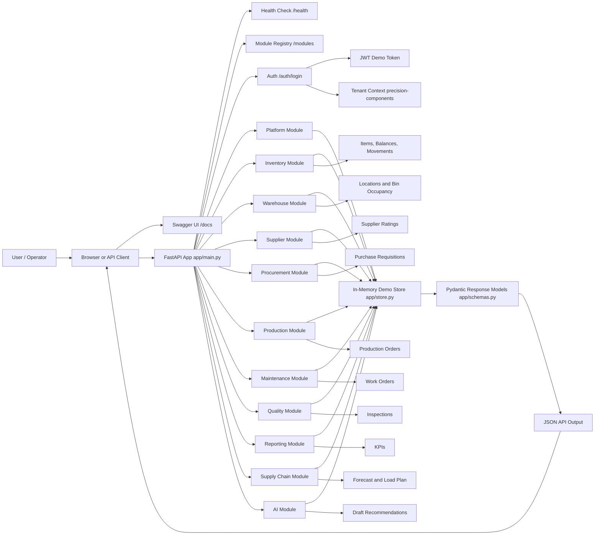
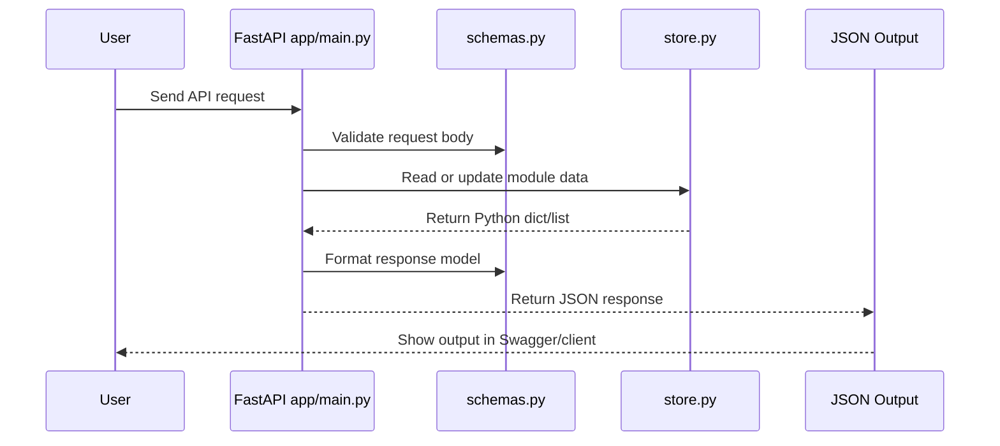

# End-to-End Scheme Diagram

This diagram shows how the Python-only Manufacturing Operations Platform works from user request to backend module output.

## Runtime Flow

1. User opens Swagger at `http://localhost:8000/docs` or calls the API from another client.
2. FastAPI receives the request in `app/main.py`.
3. Request data is validated using Pydantic classes from `app/schemas.py`.
4. The selected backend module reads or writes demo data in `app/store.py`.
5. The API returns structured JSON output using the common `ApiResult` response model.

## Code Flow

