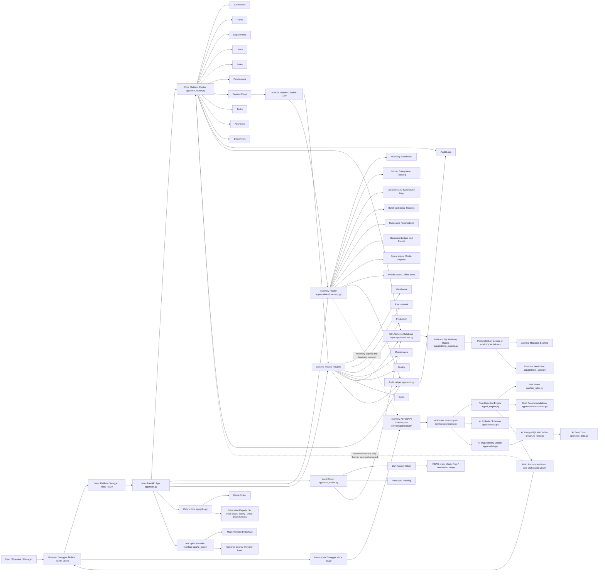
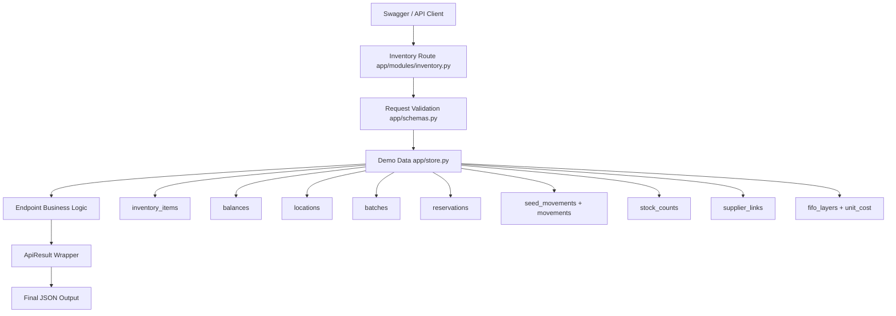
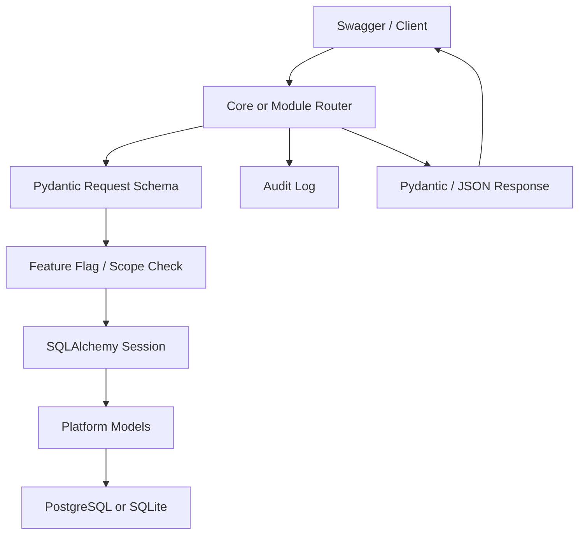
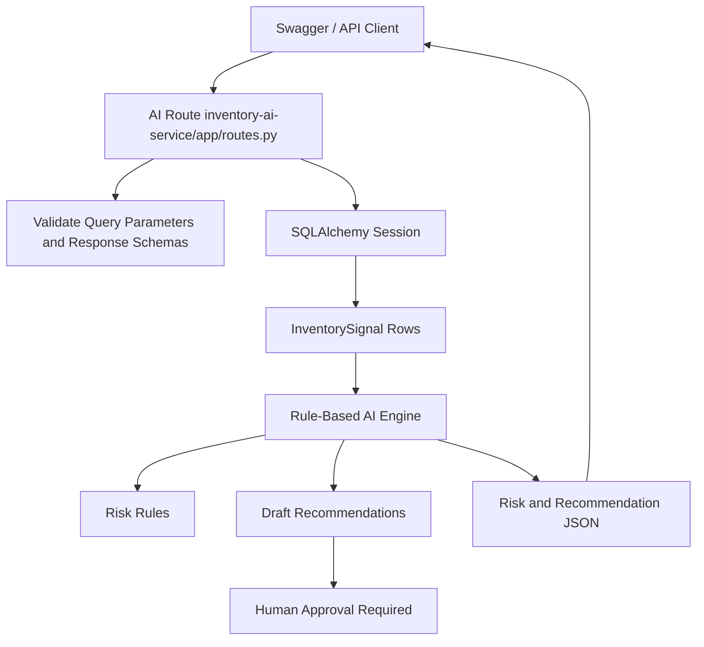
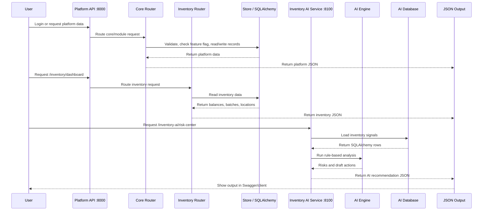
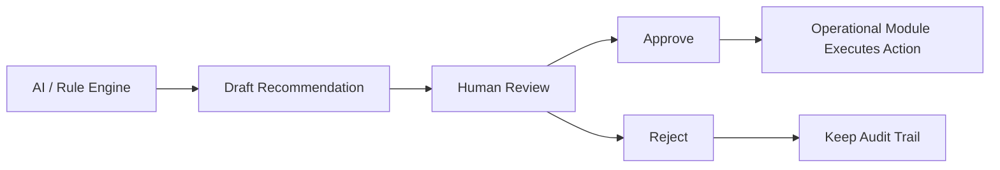

# End-to-End Scheme Diagram

This diagram shows the current Python-only Manufacturing Operations Platform after adding the modular platform foundation, expanded Inventory module, and separate `inventory-ai-service/` microservice.

There are two FastAPI services:

- Main platform API: `http://127.0.0.1:8000/docs`
- Inventory AI service: `http://127.0.0.1:8100/docs`

The AI service is recommendation-only. It analyzes risk, creates draft actions, and requires human approval for critical actions. It does not automatically move stock, create purchase orders, change production, write off inventory, or execute supplier actions.

## Runtime Flow

1. User opens the main platform Swagger at `http://127.0.0.1:8000/docs`.
2. `app/main.py` starts the main FastAPI service, creates SQLAlchemy tables when needed, and seeds demo platform data.
3. Auth requests go through `app/auth_router.py` and return JWT tokens.
4. Core platform requests go through `app/core_router.py`.
5. Company, plant, department, user, role, permission, task, approval, document, and audit data is stored through SQLAlchemy models in `app/platform_models.py`.
6. Feature flags decide whether module APIs are enabled.
7. Generic module routers store warehouse, procurement, production, maintenance, quality, and sales records in `ModuleRecord`.
8. Inventory requests go through `app/modules/inventory.py`.
9. Inventory data is validated with Pydantic schemas and returned as structured JSON.
10. Background jobs are prepared in `app/jobs.py` using Celery and Redis.
11. User opens the Inventory AI service Swagger at `http://127.0.0.1:8100/docs`.
12. Inventory AI requests go through `inventory-ai-service/app/routes.py`.
13. AI routes call rule-based logic in `ai_engine.py`, `risk_rules.py`, and `recommendations.py`.
14. AI returns analysis, risk levels, recommendations, and draft actions only.
15. Human approval is required before any critical operational action.

## Main Platform Modules

| Area | Current Code | Purpose |
| --- | --- | --- |
| Application entry | `app/main.py` | Starts FastAPI, includes routers, initializes database and seed data |
| Database layer | `app/database.py` | SQLAlchemy engine, session, base model and dependency |
| Platform models | `app/platform_models.py` | Company, plant, department, user, role, permission, flags, tasks, approvals, documents, audit logs, module records |
| Platform schemas | `app/platform_schemas.py` | Pydantic request/response models for core platform APIs |
| Auth | `app/auth_router.py`, `app/security.py` | JWT, password hashing, database-backed login structure |
| Core router | `app/core_router.py` | Core APIs and generic module router factory |
| Feature flags | `app/feature_flags.py` | Module enable/disable checks |
| Audit | `app/audit.py` | Audit log writer for platform actions |
| Seed data | `app/platform_seed.py` | Demo company, plant, admin user, roles, permissions and module flags |
| Background jobs | `app/jobs.py` | Celery jobs for reports, AI risk scans, expiry checks and dead stock checks |
| AI copilot | `app/ai_copilot/` | Provider interface with mock provider and optional OpenAI provider |
| Migrations | `alembic/` | Alembic migration scaffold |
| Docker | `docker-compose.yml` | PostgreSQL, Redis, main API and worker services |

## Generic Backend Applications

| Application | Endpoint Family | Current Behavior |
| --- | --- | --- |
| Warehouse | `/warehouses`, `/warehouse-locations`, `/warehouse-movements`, `/warehouse-occupancy` | Stores module records after feature flag validation |
| Procurement | `/suppliers`, `/purchase-requisitions`, `/purchase-orders` | Stores supplier and purchasing module records |
| Production | `/products`, `/bom`, `/routing`, `/production-orders`, `/production-schedules` | Stores manufacturing planning and execution records |
| Maintenance | `/machines`, `/maintenance-plans`, `/work-orders` | Stores equipment and maintenance records |
| Quality | `/quality/inspections`, `/quality/quarantine`, `/quality/rework`, `/quality/capa` | Stores inspection, quarantine, rework and corrective action records |
| Sales | `/customers`, `/sales-orders` | Stores customer and order records |
| Inventory | `/inventory/*` | Expanded dedicated inventory module with operational views |
| Inventory AI | `/inventory-ai/*` | Separate AI/rule-based intelligence service |

## Main Inventory Module Views

| View | Endpoint | Output |
| --- | --- | --- |
| Inventory Dashboard | `GET /inventory/dashboard` | Total inventory value, available/reserved stock, low-stock risks, expiry risks, blocked stock, warehouse occupancy |
| Inventory Items | `GET /inventory/items` | Raw materials, WIP, finished goods, consumables and spare parts |
| Category View | `GET /inventory/items/by-category` | Items grouped by category |
| Tracking Types | `GET /inventory/tracking-types` | None, batch, serial and batch+serial counts |
| Stock Location | `GET /inventory/locations` | Plant, warehouse, zone, rack, shelf, bin and exact product location |
| 2D Warehouse Map | `GET /inventory/warehouse-map` | Bin occupancy, searched item highlight, empty/full/congested areas |
| Batch and Serial | `GET /inventory/batches` | Batch number, serial number, supplier batch, manufacturing date, expiry date and status |
| Inventory Status | `GET /inventory/status` | Available, reserved, allocated, in transit, quarantine, rejected, expired, consumed, returned and damaged views |
| Reservations | `GET /inventory/reservations`, `POST /inventory/reservations` | Reserved stock for production, customer order, transfer and maintenance |
| Movement Ledger | `GET /inventory/movement-ledger`, `POST /inventory/movements` | Receiving, transfer, adjustment, consumption, return, damage, write-off and scrap audit trail |
| Stock Counting | `GET /inventory/stock-counts`, `POST /inventory/stock-counts` | Manual, cycle, barcode, QR and blind counts with variance/approval |
| Expiry and Aging | `GET /inventory/expiry-aging` | Expiring soon, expired, non-moving, slow-moving and suggested actions |
| Procurement Recommendations | `GET /inventory/procurement-recommendations` | Low stock, reorder level, safety stock, supplier lead time and purchase request draft |
| Supplier Links | `GET /inventory/supplier-links` | Primary, backup and emergency supplier data |
| Inventory Costs | `GET /inventory/costs` | FIFO costing, valuation, wastage, damaged stock cost and expiry loss |
| Reports | `GET /inventory/reports` | Status, aging, valuation, movement, occupancy and supplier performance reports |
| Mobile Inventory | `POST /inventory/mobile/scan` | Receive, move, scan, count, upload photos, offline queue and sync status |

## Inventory AI Service Views

| AI View | Endpoint | Output |
| --- | --- | --- |
| Inventory Risk Center | `GET /inventory-ai/risk-center` | Low stock, stockout, supplier delay, production, expiry and dead stock risks |
| Shortage Prediction | `GET /inventory-ai/shortage-prediction` | Available quantity, days remaining, expected stockout date and risk level |
| Overstock Prediction | `GET /inventory-ai/overstock` | Excess quantity and overstock risk |
| Procurement Recommendation | `GET /inventory-ai/procurement-recommendations` | Recommended order quantity/date, supplier priority and draft action |
| Expiry Intelligence | `GET /inventory-ai/expiry-intelligence` | Days to expiry, quantity at risk and recommended action |
| Dead Stock Detection | `GET /inventory-ai/dead-stock` | Dead stock status, days without movement and financial risk |
| Production Impact | `GET /inventory-ai/production-impact` | Can produce, shortage items and production delay risk |
| Inventory Optimization | `GET /inventory-ai/optimization` | Draft recommendations to increase/reduce safety stock, transfer, reorder or consume expiring batch first |

## Inventory Data Flow

## Platform Data Flow

## Inventory AI Data Flow

## Code Flow

## Human Approval Boundary

