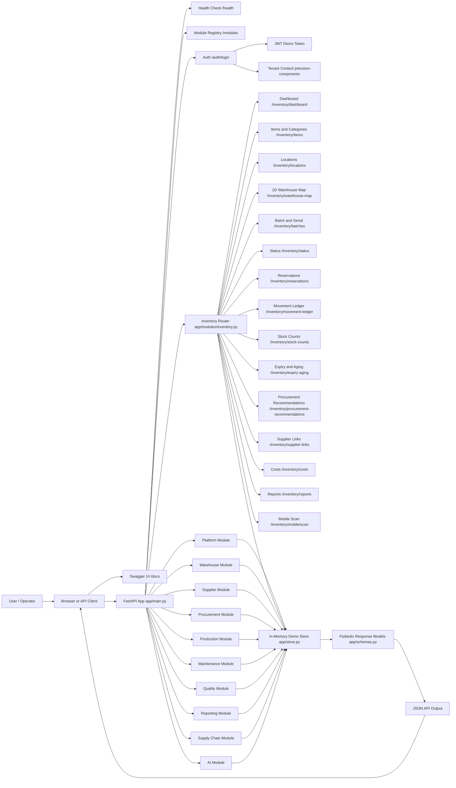
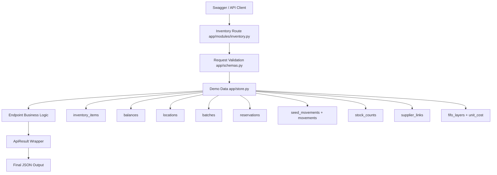
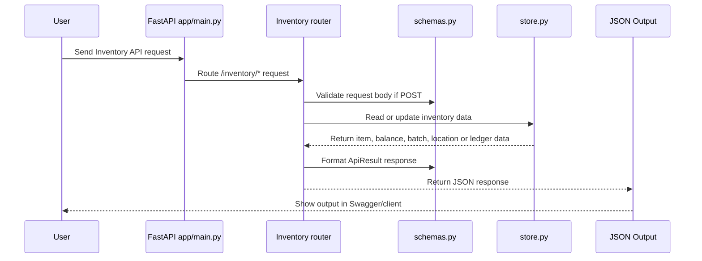

# End-to-End Scheme Diagram

This diagram shows how the Python-only Manufacturing Operations Platform works after the Inventory module expansion. The API still starts in `app/main.py`, but Inventory now has its own router in `app/modules/inventory.py`.

## Runtime Flow

1. User opens Swagger at `http://localhost:8000/docs` or calls the API from another client.
2. FastAPI receives the request in `app/main.py`.
3. `app/main.py` forwards Inventory requests to `app/modules/inventory.py`.
4. Request data is validated using Pydantic classes from `app/schemas.py`.
5. The selected endpoint reads or writes demo data in `app/store.py`.
6. The API returns structured JSON output using the common `ApiResult` response model.

## Inventory Module Views

| View | Endpoint | Output |
| --- | --- | --- |
| Inventory Dashboard | `GET /inventory/dashboard` | Total inventory value, available/reserved stock, low-stock risks, expiry risks, blocked stock, warehouse occupancy |
| Inventory Items | `GET /inventory/items` | Raw materials, WIP, finished goods, consumables and spare parts |
| Category View | `GET /inventory/items/by-category` | Items grouped by category |
| Tracking Types | `GET /inventory/tracking-types` | None, batch, serial and batch+serial counts |
| Stock Location | `GET /inventory/locations` | Plant, warehouse, zone, rack, shelf, bin and exact product location |
| 2D Warehouse Map | `GET /inventory/warehouse-map` | Bin occupancy, searched item highlight, empty/full/congested areas |
| Batch and Serial | `GET /inventory/batches` | Batch number, serial number, supplier batch, manufacturing date, expiry date and status |
| Inventory Status | `GET /inventory/status` | Available, reserved, allocated, in transit, quarantine, rejected, expired, consumed, returned and damaged views |
| Reservations | `GET /inventory/reservations`, `POST /inventory/reservations` | Reserved stock for production, customer order, transfer and maintenance |
| Movement Ledger | `GET /inventory/movement-ledger`, `POST /inventory/movements` | Receiving, transfer, adjustment, consumption, return, damage, write-off and scrap audit trail |
| Stock Counting | `GET /inventory/stock-counts`, `POST /inventory/stock-counts` | Manual, cycle, barcode, QR and blind counts with variance/approval |
| Expiry and Aging | `GET /inventory/expiry-aging` | Expiring soon, expired, non-moving, slow-moving and suggested actions |
| Procurement Recommendations | `GET /inventory/procurement-recommendations` | Low stock, reorder level, safety stock, supplier lead time and purchase request draft |
| Supplier Links | `GET /inventory/supplier-links` | Primary, backup and emergency supplier data |
| Inventory Costs | `GET /inventory/costs` | FIFO costing, valuation, wastage, damaged stock cost and expiry loss |
| Reports | `GET /inventory/reports` | Status, aging, valuation, movement, occupancy and supplier performance reports |
| Mobile Inventory | `POST /inventory/mobile/scan` | Receive, move, scan, count, upload photos, offline queue and sync status |

## Inventory Data Flow

## Code Flow

