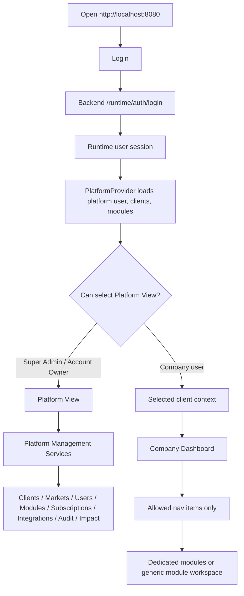
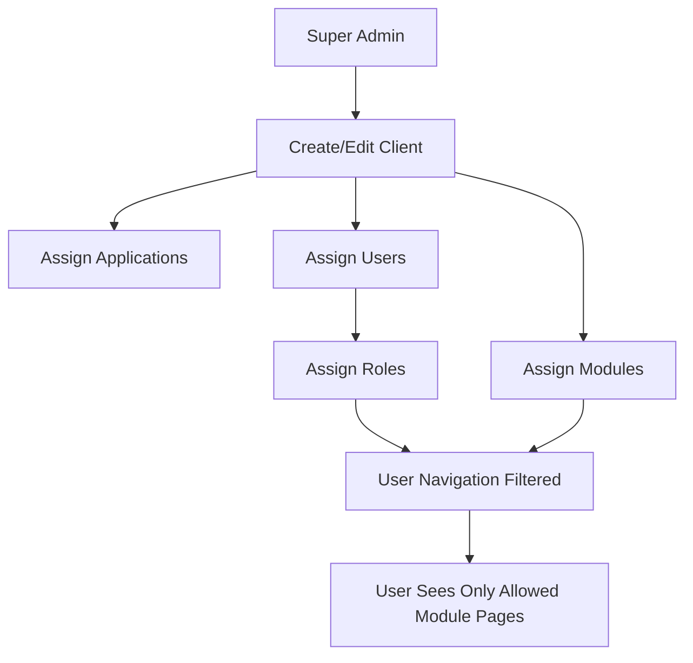

# Metam Services Platform - Complete Code and UI Review

Review date: 2026-06-29  
Repository: `C:\Users\vinod\metam-services`  
Application URL: `http://localhost:8080`  
Backend URL: `http://localhost:8000`

## 1. Executive Summary

Metam Services is currently a full-stack, multi-tenant manufacturing operations platform with:

- A React frontend using a dark glass enterprise dashboard style.
- A FastAPI backend with runtime auth, records, users, audit, companies, modules, and many module-specific APIs.
- PostgreSQL and Docker Compose support.
- Role-based navigation and module assignment logic.
- A platform management workspace for Super Admin level client, user, module, market, subscription, integration, audit, and impact management.
- Dedicated frontend module workspaces for Planning, Inventory, Warehouse, Production, and Maintenance.
- Generic backend record workspaces for Quality, Procurement, Sales, Costing, Compliance, Customer Portal, Supplier Portal, and Documents.

The main gap is this: the backend contains more module-specific capability than the frontend currently exposes. Some modules are fully shaped in UI, while others are still connected through a generic records screen.

## 2. Login and User Levels

The login screen exposes these demo users:

| Level | Email | Password | Main Experience |
|---|---|---|---|
| Super Admin | `super@metam.local` | `SuperAdmin123!` | Platform View, embedded platform management, all clients, all users, all modules, audit, admin, data hub, operations, intelligence |
| Admin | `admin@metam.local` | `ChangeMe123!` | Company-scoped admin, DataHub, dashboard, assigned modules |
| User | `user@metam.local` | `User12345!` | Dashboard and operations for assigned client/modules |

Additional platform roles exist in code:

- Super Admin
- Company Admin
- Plant Manager
- Planning Manager
- Inventory Manager
- Warehouse Manager
- Production Manager
- Maintenance Manager
- Quality Manager
- Procurement Manager
- Sales Manager
- Finance Manager
- Supervisor
- Operator
- Technician
- Customer User
- Supplier User
- Viewer

Runtime backend roles also include:

- `super_admin`
- `account_owner`
- `organization_admin`
- `admin`
- `team_manager`
- `supervisor`
- `auditor`
- `qa_tester`
- `operator`
- `custom`
- `user`

## 3. RBAC and What Each Level Sees

Frontend access is controlled in `frontend/src/lib/rbac.ts`.

| Runtime Role | Dashboard | Admin | Data Hub | Operations | Intelligence |
|---|---:|---:|---:|---:|---:|
| super_admin | Yes | Yes | Yes | Yes | Yes |
| account_owner | Yes | Yes | Yes | Yes | Yes |
| organization_admin | Yes | Yes | Yes | Yes | Yes |
| admin | Yes | Yes | Yes | Yes | Yes |
| team_manager | Yes | No | No | Yes | Yes |
| supervisor | Yes | No | No | Yes | Yes |
| auditor | Yes | No | No | Yes | Yes |
| qa_tester | Yes | No | No | Yes | Yes |
| operator | Yes | No | No | Yes | No |
| custom | Yes | No | No | Yes | No |
| user | Yes | No | No | Yes | No |

Important permission helpers:

- `canCreateCompanies`: only `super_admin` and `account_owner`.
- `canWriteOperationalData`: requires `data.write`.
- `canReadAuditLogs`: requires `audit.read`.
- `canEditExecutiveMetrics`: `admin` and `super_admin`.
- `canUseDataHubUploads`: `admin` and `super_admin`.

## 4. End-to-End Click Flow

## 5. Super Admin Experience

Super Admin enters the application in Platform View.

Visible platform summary cards include:

- Total Clients
- Active Clients
- Inactive Clients
- Trial Clients
- Total Users
- Active Users
- Locked Users
- Disabled Users
- Module Health
- Subscription Health
- Integration Health
- Audit Activity
- Business Impact
- System Health

Clicking platform cards keeps the user inside the embedded platform workspace. It does not open a separate page.

### Platform Management Services Tabs

| Tab | What Super Admin Can Do |
|---|---|
| Clients | Search clients, filter by region/status, add client, view client, edit client, enable/disable client with audit reason |
| Markets | Manage region/market context and client-market allocation |
| Users | Create/edit users, assign client, assign roles, applications, modules, status |
| Modules | Search modules, inspect module health, assign/remove clients, assign/remove users |
| Subscriptions | Manage plan, cycle, renewal, limits, and status |
| Integrations | View integration health by client |
| Audit | Filter audit by client, module, action, and search text |
| Business Impact | Review business value and improvement impact |

### Client Creation Flow

Click path:

`Platform View -> Platform Management Services -> Clients -> Add Client`

Fields and behavior:

- Client Name is required.
- Client Name must be unique.
- Region filters market options.
- Market auto-selects currency and timezone.
- Currency is editable.
- Applications are searchable, selectable, clearable, and counted.
- Modules are searchable, selectable, clearable, and counted.
- Assignment reason is required.
- Client ID is auto-generated.
- Audit log is created.
- Client becomes visible in the top-left client selector.

### Client Edit Flow

Click path:

`Platform View -> Platform Management Services -> Clients -> Edit`

Super Admin can update:

- Client name
- Industry
- Region
- Market
- Currency
- Status
- Enabled applications
- Enabled modules
- Assigned users
- Change reason

The edit action writes into platform state and records an audit event.

### User Edit Flow

Click path:

`Platform View -> Platform Management Services -> Users -> Edit`

Super Admin can update:

- User name
- Client assignment
- Roles
- Applications
- Modules
- Status
- Reason/audit trail

### Module Assignment Flow

Click path:

`Platform View -> Platform Management Services -> Modules`

Super Admin can:

- Search modules.
- Filter module health/availability/client.
- View module allocation.
- Add/remove clients.
- Add/remove users.
- See counts such as enabled/disabled state and visible row count.

## 6. Admin Experience

Admin users are company-scoped. They should not see other companies' data.

Visible sections:

- Dashboard
- Admin
- Data Hub
- Operations
- Intelligence
- Assigned modules only

Admin Center routes include:

- `/admin/company`
- `/admin/roles`
- `/admin/access`
- `/admin/modules`
- `/admin/dashboards`
- `/admin/data-scope`
- `/admin/audit`
- `/admin/business-impact`
- `/admin/recommendations`
- `/admin/settings`

Admin users can manage company-level access and DataHub, but platform-wide client creation belongs to Super Admin / Account Owner.

## 7. Manager, Supervisor, Auditor, QA, Operator, and User Experience

| Level | Main Frontend Experience |
|---|---|
| Team Manager | Dashboard, operations, intelligence. No Admin/DataHub. |
| Supervisor | Dashboard, operations, intelligence. Can work on assigned operational modules. |
| Auditor | Dashboard, operations, intelligence. Audit permission exists in backend, but frontend audit access depends on page exposure. |
| QA Tester | Dashboard, operations, intelligence. Backend has quality write/data read permissions. |
| Operator | Dashboard and operations only. |
| User | Dashboard and operations only. |

Navigation is filtered by both:

- runtime role permissions, and
- selected client enabled modules plus platform user assigned modules.

If a module is not assigned, the user sees a module-not-enabled message instead of the workspace.

## 8. Module Capability vs Current UI vs Missing Links

| Module | Backend / Code Capability | Current UI Given | Missing / Not Fully Linked |
|---|---|---|---|
| Platform Management | Clients, users, roles, modules, markets, subscriptions, audit, impact state | Strong embedded workspace with tabs and drawers | Platform workspace is still mostly frontend platform state/local storage; not fully unified with backend DB persistence for every platform action |
| Admin | Companies, roles, permissions, feature flags, dashboards, data scope, audit, recommendations | Company admin pages and platform redirects | Some buttons remain summary/action style and not all admin actions call backend APIs |
| Dashboard | Runtime analytics, AI readiness, operational footprint, dashboard cards | Modern dashboard with clickable cards for admin/super admin | Some dashboard drilldowns are frontend-only summaries |
| Data Hub | Connected systems, data catalog, mappings, upload, cloud source setup | Data catalog/source forms, upload/dropbox for admin/super admin | Needs deeper per-source authentication workflows for SAP/ERP/Google Drive/OneDrive and full ingestion validation |
| Planning | Demand, inventory, production, capacity, material, procurement, workforce, maintenance planning, scenarios, approvals, reports, audit | Dedicated Planning Control Tower with side nav, search/filter tables, charts, drawers | Create drawers are UI shells; not all planning records are persisted to backend module-specific tables |
| Inventory | Items, receipts, issues, transfers, adjustments, counts, physical inventory, aging, dead stock, slow moving, reorder, lots, serials, valuation, audit, reports | Dedicated Inventory Control Tower with full section nav, charts, tables, filters, drawers | Dedicated UI uses seeded frontend data; backend runtime records also exist separately. Needs one unified DB-backed inventory source |
| Warehouse | Receiving, putaway, bins, picking, packing, dispatch, movements, cycle counts, utilization, labor, reports, audit | Dedicated Warehouse Control Tower | Create/update flows need deeper backend persistence and workflow assignment |
| Production | Orders, schedule, work orders, shifts, lines, machines, tracking, downtime, OEE, yield, scrap, reports, audit | Dedicated Production Control Tower | Real machine/MES ingestion and task notification workflow are not fully connected |
| Maintenance | Assets, hierarchy, work orders, preventive, corrective, breakdown, calendar, spares, cost, asset health, reports, audit | Dedicated Maintenance Control Tower | Work orders and technician assignment need full backend workflow/inbox integration |
| Quality | Backend module exists with quality-related capability | Generic backend records workspace | Needs dedicated Quality UI like Planning/Inventory with inspections, NCR, CAPA, release/reject, audit |
| Procurement | Backend and planning procurement concepts exist | Generic backend records workspace plus Planning procurement section | Needs dedicated Procurement module UI for PR, RFQ, PO, supplier, approvals, GRN link |
| Sales & Distribution | Backend module exists | Generic backend records workspace | Needs dedicated Sales module UI for orders, shipments, returns, pricing, customer status |
| Costing & Profitability | Backend module exists | Generic backend records workspace | Needs dedicated costing UI for product cost, variance, margin, profit analytics |
| Compliance | Route exists with generic workspace | Generic backend records workspace | Needs compliance-specific backend/UI: regulations, checklists, evidence, deviations, signoff |
| Customer Portal | Backend route/module exists | Generic backend records workspace | Needs customer-specific login, order visibility, claims, documents, notifications |
| Supplier Portal | Backend route/module exists | Generic backend records workspace | Needs supplier-specific login, ASN, quality docs, delivery commitments, portal UX |
| Reports & Analytics | Reporting backend exists; business impact UI exists | `/reports` opens Business Impact Dashboard | Reporting scheduler/export/catalog APIs are not fully surfaced |
| Document Management | Core document endpoints exist | Generic backend records workspace | Needs document library, versioning, approval, upload, access control |
| Integration Hub | Connected systems and integration health exist | DataHub and platform integration health | Needs dedicated integration operations page with retries, logs, credentials, connector status |
| AI Intelligence | Manufacturing intelligence backend exists; AI code intentionally preserved | Intelligence page and readiness dashboard pieces | AI engine outputs are not fully connected into every module workflow yet |
| Mobile | Backend/mobile capability exists | No dedicated mobile UI route | Needs responsive mobile workflows for receive, move, scan, count, offline sync |

## 9. Dedicated Module Click Behavior

### Planning

Main route: `/planning`

Side navigation:

- Planning Dashboard
- Demand Planning
- Inventory Planning
- Production Planning
- Capacity Planning
- Material Planning
- Procurement Planning
- Workforce Planning
- Maintenance Planning
- Scenario Planning
- Planning Approvals
- Planning Reports
- Planning Audit

Click behavior:

- Dashboard cards navigate to related sections.
- Register pages support search and status filter.
- Create buttons open drawers.
- Approval and audit sections show governance records.

### Inventory

Main route: `/inventory`

Side navigation:

- Inventory Dashboard
- Inventory Overview
- Goods Receipts
- Goods Issues
- Stock Transfers
- Inventory Adjustments
- Cycle Counts
- Physical Inventory
- Inventory Aging
- Dead Stock
- Slow Moving Stock
- Reorder Management
- Lot Management
- Serial Tracking
- Inventory Valuation
- Inventory Audit
- Inventory Reports

Click behavior:

- Sidebar changes the section without leaving module context.
- Search filters tables.
- Status filter narrows rows.
- Create buttons open drawers.
- Reports show export action buttons.

### Warehouse

Main route: `/warehouse`

Side navigation:

- Warehouse Dashboard
- Receiving
- Putaway
- Bin Management
- Picking
- Packing
- Dispatch
- Internal Movements
- Cycle Counts
- Warehouse Utilization
- Warehouse Labor
- Warehouse Reports
- Warehouse Audit

Click behavior is the same module pattern: dashboard cards, section navigation, register tables, search/status filters, create drawers, reports, audit.

### Production

Main route: `/production`

Side navigation:

- Production Dashboard
- Production Orders
- Production Schedule
- Work Orders
- Shift Management
- Production Lines
- Machine Monitoring
- Production Tracking
- Downtime Management
- OEE Dashboard
- Yield Analysis
- Scrap Analysis
- Production Reports
- Production Audit

Click behavior:

- Dedicated pages for each manufacturing execution area.
- Downtime and OEE have richer dashboards.
- Register sections use search/status/create drawer pattern.

### Maintenance

Main route: `/maintenance`

Side navigation:

- Maintenance Dashboard
- Asset Register
- Asset Hierarchy
- Work Orders
- Preventive Maintenance
- Corrective Maintenance
- Breakdown Maintenance
- Maintenance Calendar
- Spare Parts
- Maintenance Cost
- Asset Health
- Maintenance Reports
- Maintenance Audit

Click behavior:

- Asset/work-order/spares/register pages use the same filtered table pattern.
- Cost and asset health show metric cards plus charts/tables.
- Create buttons open drawers.

### Generic Backend Workspace Modules

Routes:

- `/quality`
- `/procurement`
- `/sales`
- `/costing`
- `/compliance`
- `/customer-portal`
- `/supplier-portal`
- `/documents`

Current behavior:

- Shows module title and description.
- Loads `/runtime/records?module_key=<module>`.
- Allows create record if user has `data.write`.
- Allows update status/quantity if backend rows exist and user can write.
- Allows delete if backend rows exist and user can write.
- Shows fallback sample rows if backend has no data.
- Shows backend record volume chart.

This is functional, but not yet a dedicated enterprise module experience.

## 10. Work Allocation and Notifications

Current allocation model:

What exists:

- Super Admin can assign users to clients.
- Super Admin can assign roles, applications, and modules.
- Module workspace can assign/remove clients and users.
- Company Admin sees company-scoped pages.
- Dedicated modules show work records, planning actions, approvals, audit, and status.
- Backend has tasks, approvals, notifications, and audit concepts across core/modules.

What is missing:

- A centralized "My Work" inbox.
- End-to-end assignment notification flow in frontend.
- Manager notification dashboard when worker status changes.
- Assignment lifecycle from "create task -> assign user -> notify user -> user completes -> manager approves" across all modules.
- Unified DB-backed audit trail connecting every frontend platform action and every backend runtime/module action.

## 11. Backend APIs Present

Major backend areas found:

- Auth: login/session.
- Runtime users.
- Runtime records CRUD.
- Runtime analytics.
- Runtime audit logs.
- Companies, plants, departments.
- Roles, permissions, feature flags.
- Tasks and approvals.
- Documents.
- Inventory module.
- Production module.
- Maintenance module.
- Quality module.
- Reporting module.
- Sales module.
- Costing module.
- Integrations.
- Customer portal.
- Supplier portal.
- Mobile.
- Manufacturing intelligence.

The frontend does not yet expose every backend module with a dedicated UI.

## 12. Screenshot Reference Plan

Real screenshots were not captured during this review because the local Playwright browser binary is not installed in the current Codex runtime. The following are the exact screenshot references that should be captured for the final visual manual.

| Ref | URL | Login | What Screenshot Should Show |
|---|---|---|---|
| S1 | `http://localhost:8080/` | Not logged in | Login page with Metam Services branding and demo credentials |
| S2 | `http://localhost:8080/platform` | Super Admin | Platform summary cards and client selector in Platform View |
| S3 | `http://localhost:8080/platform?workspace=clients` | Super Admin | Clients workspace with Add Client, View, Edit, Enable/Disable |
| S4 | `http://localhost:8080/platform?workspace=users` | Super Admin | Users workspace with create/edit/role/client/module assignment |
| S5 | `http://localhost:8080/platform?workspace=modules` | Super Admin | Module health table with client/module filters and allocation view |
| S6 | `http://localhost:8080/platform?workspace=audit` | Super Admin | Audit table filtered by client/module/action |
| S7 | `http://localhost:8080/admin/company` | Admin | Company profile, access summary, company-scoped controls |
| S8 | `http://localhost:8080/data-hub` | Admin | DataHub catalog, upload/dropbox, source configuration |
| S9 | `http://localhost:8080/inventory` | Admin/User with Inventory | Inventory Control Tower dashboard |
| S10 | `http://localhost:8080/planning` | Admin/User with Planning | Planning Control Tower dashboard |
| S11 | `http://localhost:8080/warehouse` | Admin/User with Warehouse | Warehouse Control Tower dashboard |
| S12 | `http://localhost:8080/production` | Admin/User with Production | Production Control Tower dashboard |
| S13 | `http://localhost:8080/maintenance` | Admin/User with Maintenance | Maintenance Control Tower dashboard |
| S14 | `http://localhost:8080/quality` | Admin/User with Quality | Generic backend records workspace for Quality |
| S15 | `http://localhost:8080/` | User | Limited dashboard/operations view without Admin/DataHub |

## 13. What Should Be Built Next

Priority 1:

- Connect platform management state to backend database tables, not only frontend state/local storage.
- Create a centralized work allocation and notification center.
- Link every create/edit drawer in dedicated modules to backend persistence.

Priority 2:

- Build dedicated frontend pages for Quality, Procurement, Sales, Costing, Compliance, Customer Portal, Supplier Portal, Reports, Documents, Integration Hub, and Mobile.
- Unify module audit logs with platform audit logs.
- Add manager approval workflow across all modules.

Priority 3:

- Connect AI Intelligence to module workflows.
- Add AI recommendations into Planning, Inventory, Warehouse, Production, and Maintenance.
- Keep AI as recommend/draft-only, requiring human approval for critical actions.

## 14. Final Review Status

Implemented strongly:

- Platform View and embedded platform management.
- Super Admin client/user/module assignment flow.
- RBAC-based navigation.
- Dedicated Planning, Inventory, Warehouse, Production, and Maintenance module pages.
- Runtime record CRUD workspace.
- DataHub upload/source/catalog direction.
- Dockerized full-stack platform.

Partially implemented:

- Admin workflows.
- Backend-to-frontend linkage for every module.
- Audit unification.
- Task assignment and notification lifecycle.
- AI intelligence integration.

Missing from frontend:

- Dedicated UI for several backend modules.
- Central work inbox.
- Manager notification workflow.
- Full screenshot-backed user manual.
- Full DB persistence for all platform management actions.

