# Metam Services - Real-Time Screenshot Walkthrough

Captured from the running Docker application on 2026-06-29.  
Application URL: `http://localhost:8080`  
Backend URL: `http://localhost:8000`

This document shows how the platform looks in real time for the main user levels and core modules. Each screenshot is followed by a simple explanation of what the user sees, what they can click, and what happens next.

## 1. Login Screen

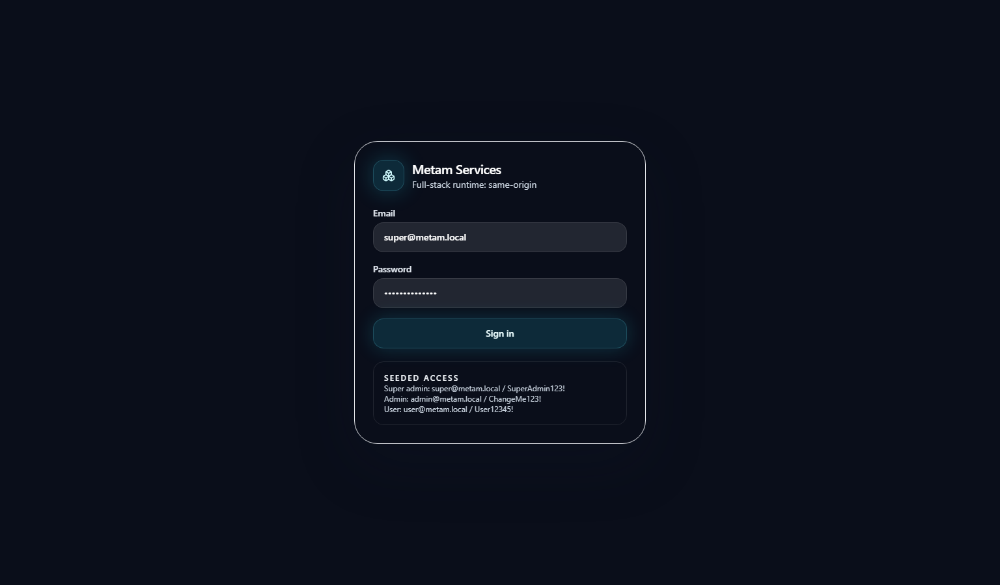

What you see:

- Metam Services login card.
- Runtime backend URL.
- Email and password fields.
- Seeded demo credentials for Super Admin, Admin, and User.

What the user does:

- Enters email and password.
- Clicks **Sign in**.

What happens:

- Frontend calls `POST /runtime/auth/login`.
- Backend validates the user.
- Token is stored in browser local storage.
- Frontend calls `GET /runtime/auth/me`.
- The application opens the correct role-based workspace.

## 2. Super Admin - Platform Dashboard

What Super Admin sees:

- Platform View selected in the top-left selector.
- Platform-level cards for clients, users, module health, subscription health, integration health, audit activity, business impact, and system health.
- Sidebar focused on Platform and Admin.

What can be clicked:

- Summary cards open the embedded platform management workspace.
- Client selector can switch between Platform View and a client/company.
- Sidebar **Admin** opens company/admin controls.

What happens:

- No separate page is opened for platform summaries.
- The lower embedded workspace changes context inside the same page.

## 3. Super Admin - Clients Workspace

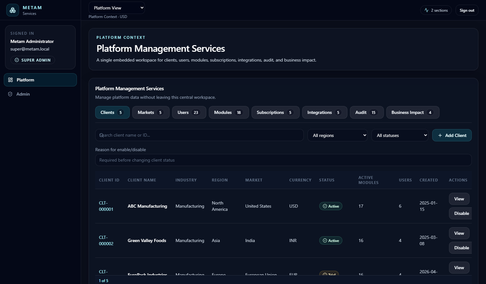

What Super Admin sees:

- Platform Management Services.
- Clients tab.
- Search by client name or ID.
- Region/status filters.
- Add Client button.
- Client table with View, Edit, Enable/Disable actions.

What can be clicked:

- **Add Client** opens client creation drawer.
- **View** opens client profile/details.
- **Edit** opens edit drawer.
- **Enable/Disable** changes client status, but requires a reason.

What happens:

- Client filters update the table immediately.
- Enable/disable creates an audit entry in platform state.

## 4. Super Admin - Create Client Drawer

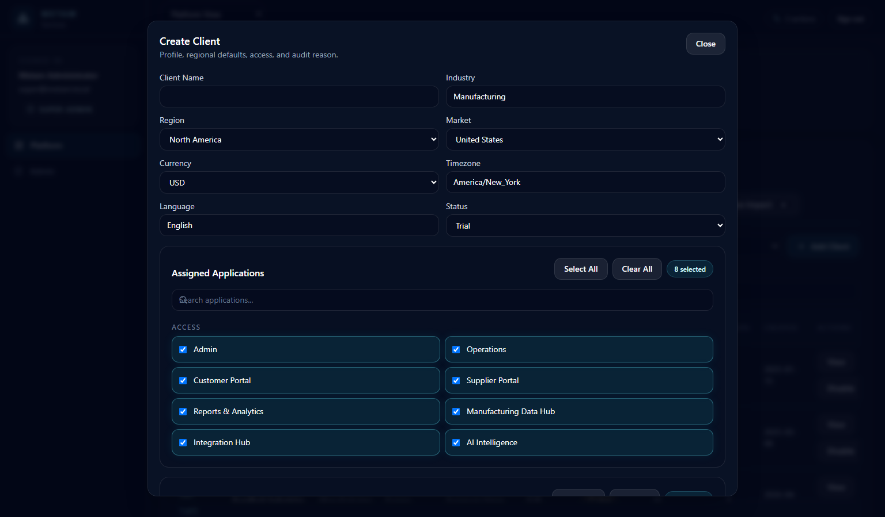

What Super Admin sees:

- Create Client drawer opens in the center/right workspace.
- Client profile fields.
- Region, market, currency, timezone, language, and status.
- Assigned Applications selector.
- Assigned Modules selector.
- Required assignment reason.

Important rules:

- Client Name is required.
- Client Name must be unique.
- At least one application is required.
- At least one module is required.
- Reason is required.
- Market updates currency/timezone defaults.

What happens after Create Client:

- A client ID is generated.
- Client appears in platform clients.
- Client appears in top-left client selector.
- An audit entry is recorded.

## 5. Super Admin - Users Workspace

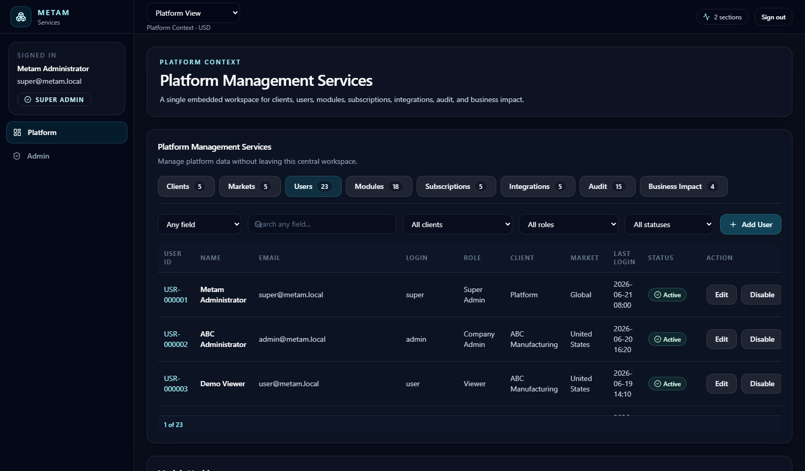

What Super Admin sees:

- Users tab inside Platform Management Services.
- User list with company/client assignment.
- User status and role information.
- Create/edit style actions.

What can be managed:

- User profile.
- Assigned client/company.
- Roles.
- Applications.
- Modules.
- Enabled/disabled status.

What happens:

- User assignment controls what navigation and modules the user sees.
- Removing a user from a client removes access to that client's modules.

## 6. Super Admin - Module Health and Allocation

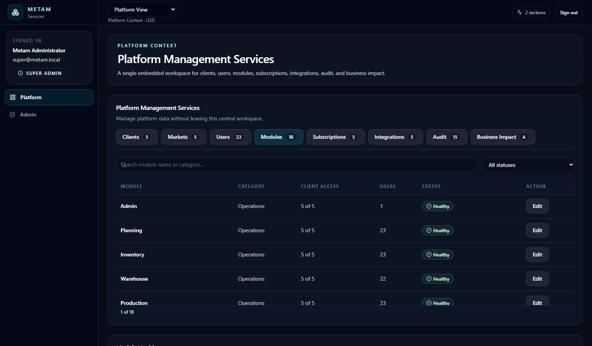

What Super Admin sees:

- Module health table.
- Module name.
- Availability.
- Health status.
- Client.
- Last updated.
- View action.
- Count indicator at the bottom.

What can be clicked:

- Column headings open integrated filters/search controls.
- View opens module allocation detail.
- Client/module filters narrow what is displayed.

What happens:

- Default view shows all clients/modules.
- Selecting a client updates health to that client only.
- Module rows show whether the module is enabled and healthy.

## 7. Super Admin - Audit Workspace

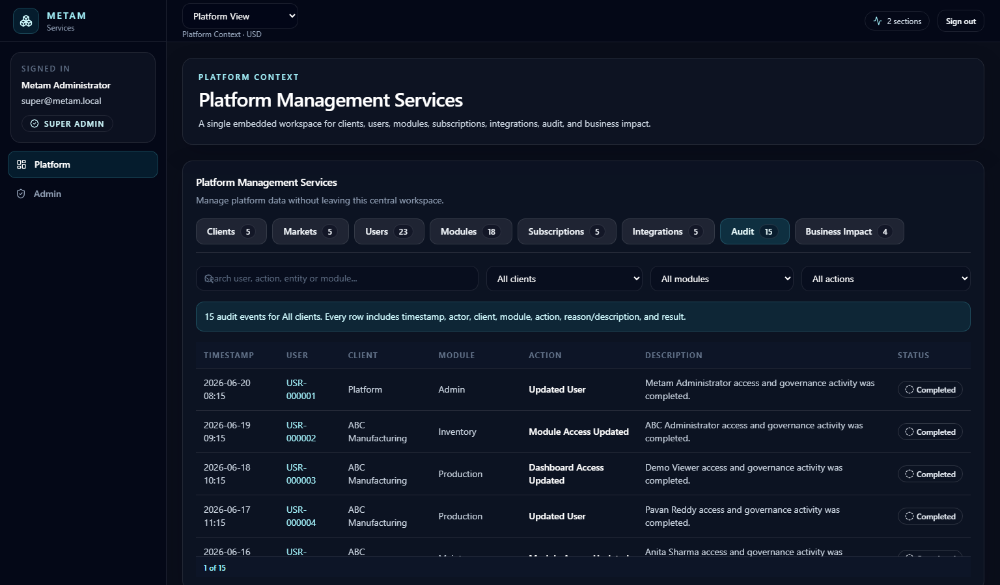

What Super Admin sees:

- Audit tab.
- Audit activity table.
- Filters for client, module, action, and search.
- Activity details showing what changed and why.

What can be clicked:

- Filters narrow audit records.
- Search finds specific users/actions/modules.

What happens:

- Super Admin can trace platform-level changes.
- This is currently platform audit state; backend audit unification is still a future improvement.

## 8. Admin - Company Center

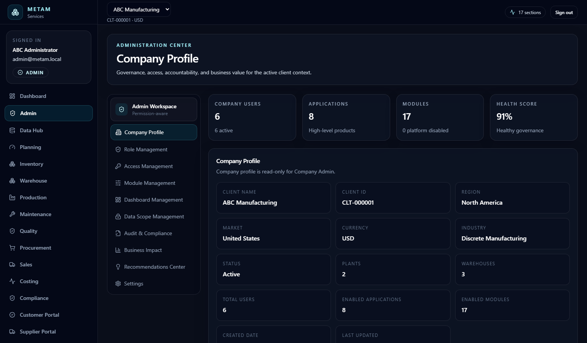

What Admin sees:

- Company-scoped admin center.
- Company users count.
- Applications/modules count.
- Health score.
- Company profile.
- Enabled applications and modules.

What Admin can do:

- Review company profile.
- Review assigned applications/modules.
- Open module usage/admin sections.
- Use company-scoped admin controls.

What Admin cannot do:

- See all companies.
- Create platform-wide clients.
- Access Super Admin platform management unless elevated.

## 9. Admin - DataHub

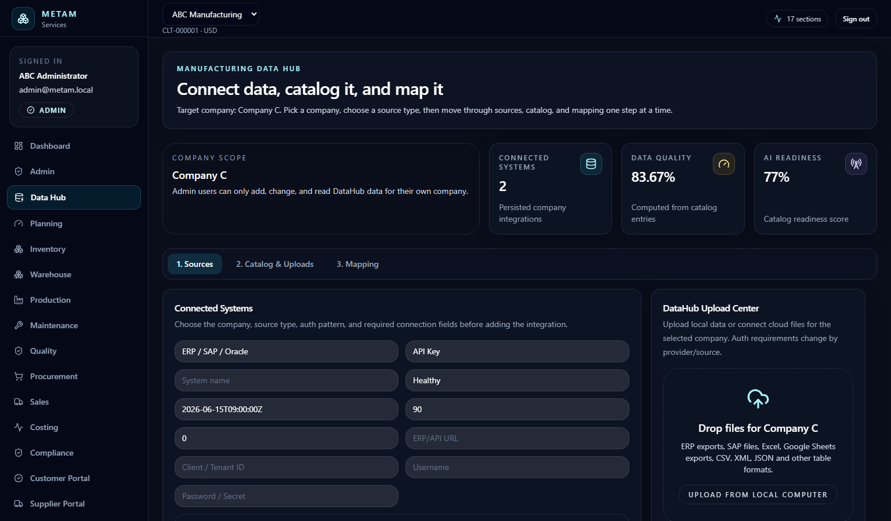

What Admin sees:

- DataHub workspace.
- Data quality and AI readiness areas.
- Connected systems/catalog/upload/source configuration.
- Upload/drop area for data files.

What can be uploaded or configured:

- ERP exports.
- SAP files.
- Excel sheets.
- Standard table formats.
- Cloud source links such as Google Drive/OneDrive style sources.

What happens:

- Frontend calls DataHub APIs such as catalog, mapping, uploads, and cloud source endpoints.
- Admin/Super Admin can manage DataHub.
- Non-admin users should not access upload management.

## 10. Planning Control Tower

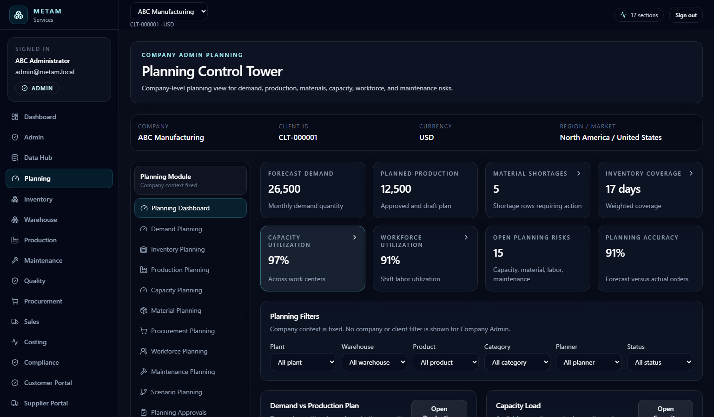

What the user sees:

- Planning Control Tower.
- Company context.
- Planning module sidebar.
- Planning KPI cards.
- Charts and planning actions.

Main sections:

- Demand Planning.
- Inventory Planning.
- Production Planning.
- Capacity Planning.
- Material Planning.
- Procurement Planning.
- Workforce Planning.
- Maintenance Planning.
- Scenarios.
- Approvals.
- Reports.
- Audit.

What happens after clicks:

- Sidebar opens the selected planning section.
- KPI cards can route to related sections.
- Search/filter controls narrow records.
- Create buttons open drawers.

## 11. Inventory Control Tower

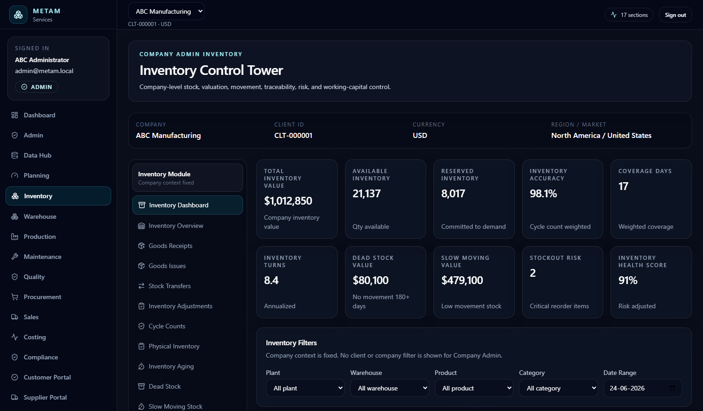

What the user sees:

- Inventory Control Tower.
- Total inventory value.
- Available inventory.
- Reserved inventory.
- Accuracy, coverage, turns, dead stock, slow moving, stockout risk, health score.
- Inventory filters and charts.

Main sections:

- Inventory Overview.
- Goods Receipts.
- Goods Issues.
- Transfers.
- Adjustments.
- Cycle Counts.
- Physical Inventory.
- Aging.
- Dead Stock.
- Slow Moving.
- Reorder.
- Lots.
- Serials.
- Valuation.
- Audit.
- Reports.

What happens after clicks:

- Sidebar opens section pages.
- Tables are searchable/filterable.
- Create buttons open drawers.
- Reports expose preview/export actions.

## 12. Warehouse Control Tower

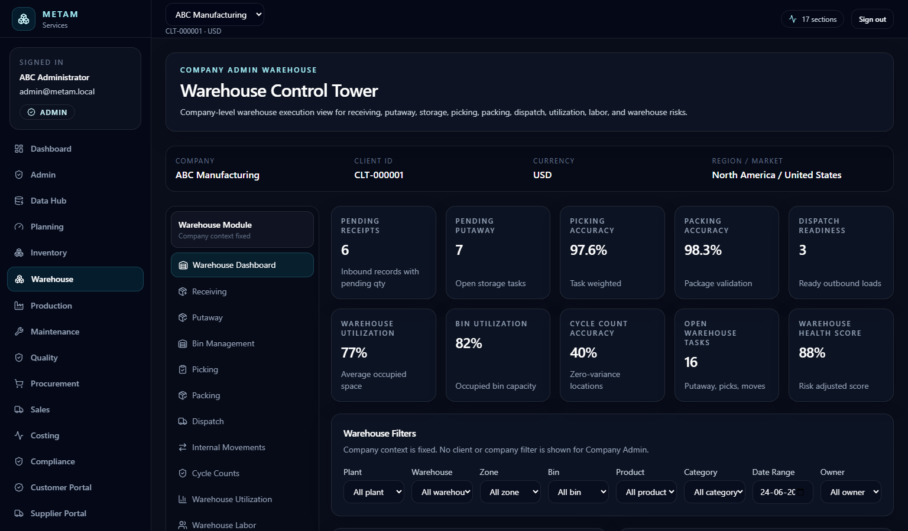

What the user sees:

- Warehouse Control Tower.
- Warehouse module sidebar.
- Cards for receipts, putaway, picking accuracy, packing accuracy, dispatch readiness, utilization, cycle count accuracy, task health.

Main sections:

- Receiving.
- Putaway.
- Bin Management.
- Picking.
- Packing.
- Dispatch.
- Internal Movements.
- Cycle Counts.
- Utilization.
- Labor.
- Reports.
- Audit.

What happens:

- User can navigate warehouse execution stages.
- Search and status filters are available in registers.
- Create buttons open task/record drawers.

## 13. Production Control Tower

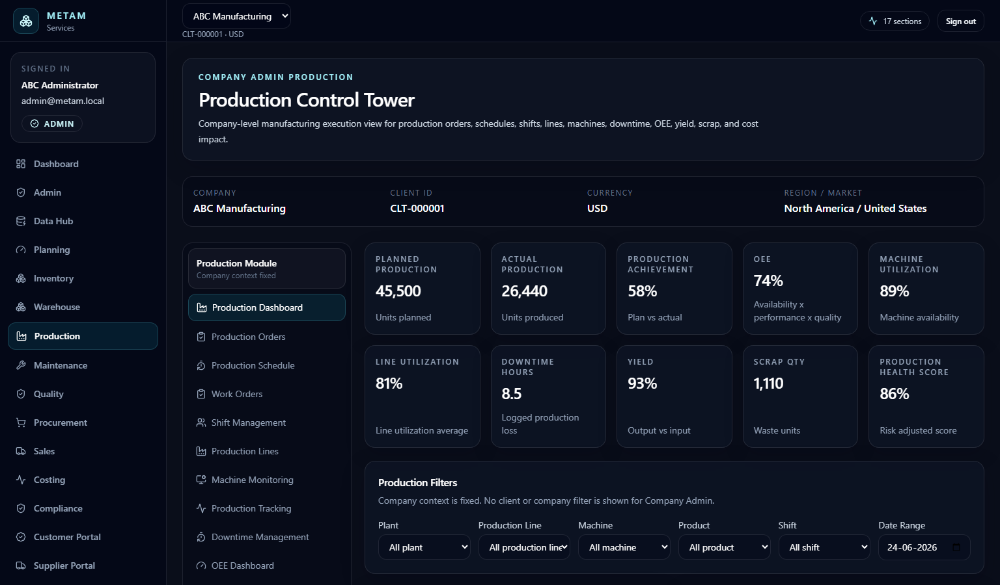

What the user sees:

- Production Control Tower.
- Production KPI cards.
- Production module sidebar.
- Manufacturing charts and records.

Main sections:

- Production Orders.
- Production Schedule.
- Work Orders.
- Shift Management.
- Production Lines.
- Machine Monitoring.
- Production Tracking.
- Downtime.
- OEE.
- Yield.
- Scrap.
- Reports.
- Audit.

What happens:

- Section clicks open manufacturing execution pages.
- Downtime and OEE sections show deeper analytics.
- Create buttons open operational drawers.

## 14. Maintenance Control Tower

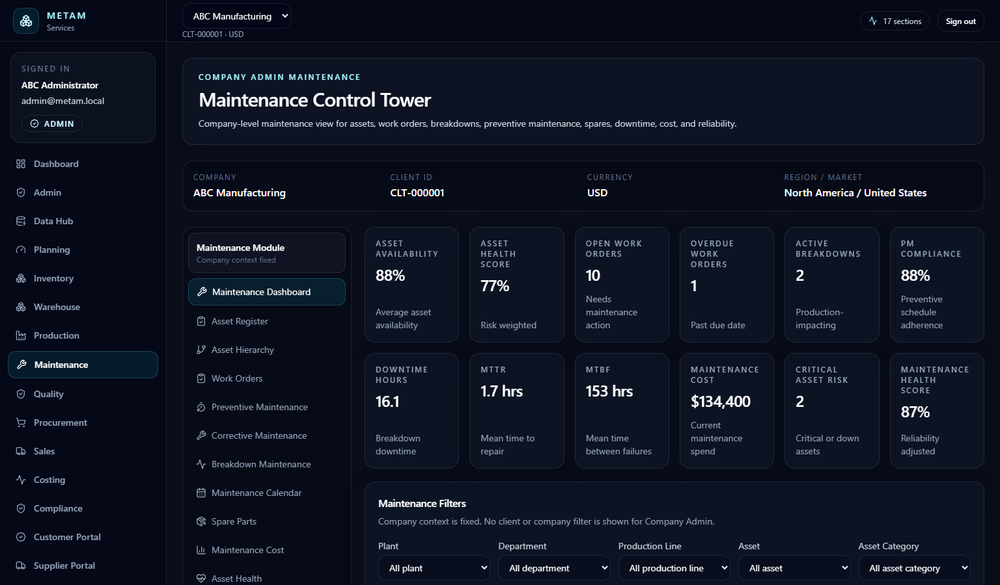

What the user sees:

- Maintenance Control Tower.
- Asset availability.
- Asset health.
- Open/overdue work orders.
- Breakdowns.
- PM compliance.
- MTTR/MTBF.
- Maintenance cost.

Main sections:

- Asset Register.
- Asset Hierarchy.
- Work Orders.
- Preventive Maintenance.
- Corrective Maintenance.
- Breakdown Maintenance.
- Calendar.
- Spare Parts.
- Cost.
- Asset Health.
- Reports.
- Audit.

What happens:

- Maintenance teams can review assets, spares, work orders, costs, and health.
- Dedicated backend work-order APIs exist, but full frontend action wiring is still an improvement area.

## 15. Quality - Generic Backend Workspace

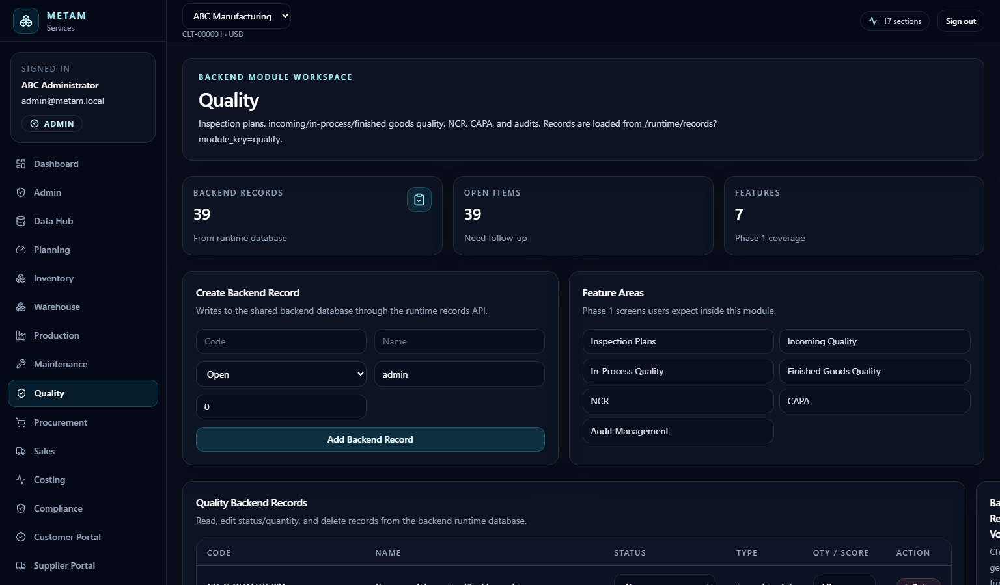

What the user sees:

- Quality module opened through the generic backend workspace.
- Backend record count.
- Open items.
- Feature areas.
- Create backend record form.
- Backend records table.
- Record volume chart.

What can be done:

- Create a record if the role has `data.write`.
- Edit status/quantity for backend rows.
- Delete backend rows if permitted.

Important note:

- Quality has rich backend APIs for inspections, defects, quarantine, CAPA, reports, tasks, and notifications.
- The dedicated Quality UI is still missing; this screen is a functional generic shell.

## 16. User - Limited Dashboard

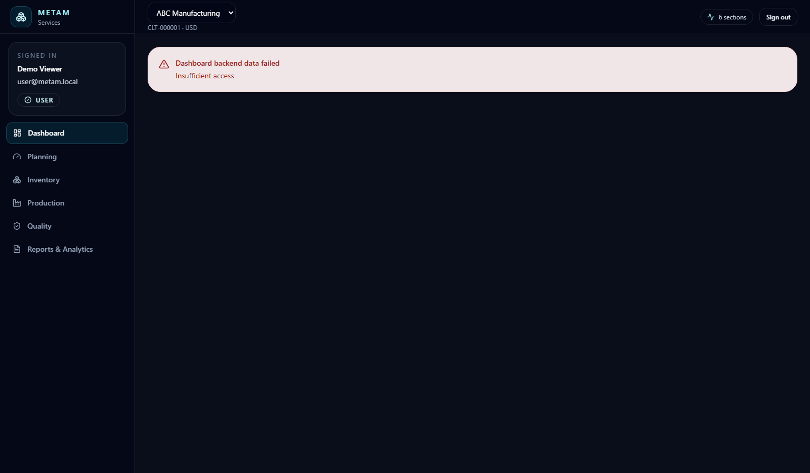

What a normal User sees:

- Limited dashboard.
- Navigation based on assigned modules and role.
- No Super Admin platform management.
- No Admin/DataHub if not permitted.

What happens:

- The sidebar is filtered by role and module assignment.
- Restricted pages show access denied or are hidden.
- Write actions are unavailable unless `data.write` permission exists.

## Summary

The screenshots show the real current state:

- Super Admin has the platform-level operating view.
- Admin has company-scoped admin and DataHub.
- Planning, Inventory, Warehouse, Production, and Maintenance have dedicated control tower screens.
- Quality and similar modules currently use a generic backend workspace.
- User-level access is restricted by role, client, and module assignment.

